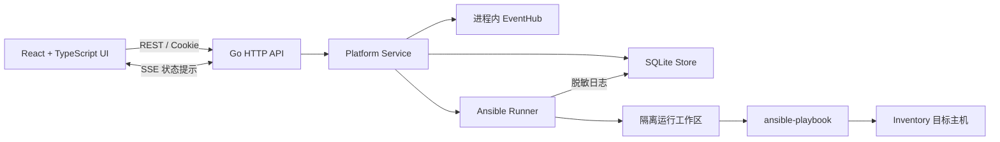
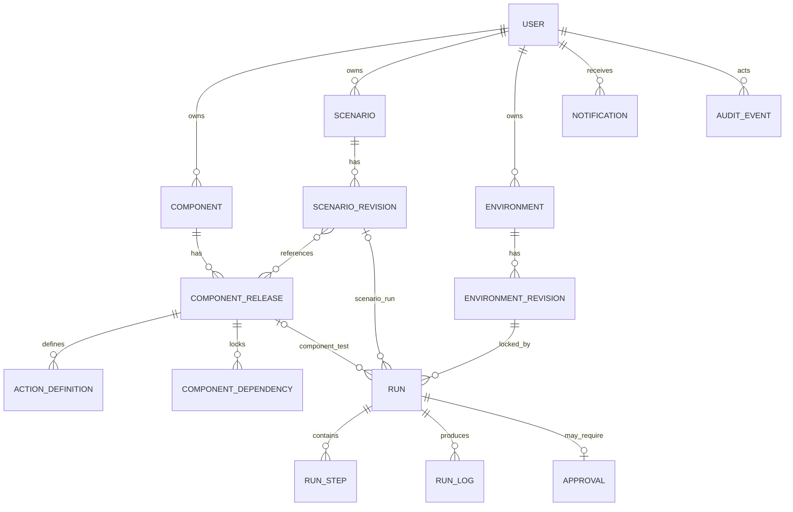
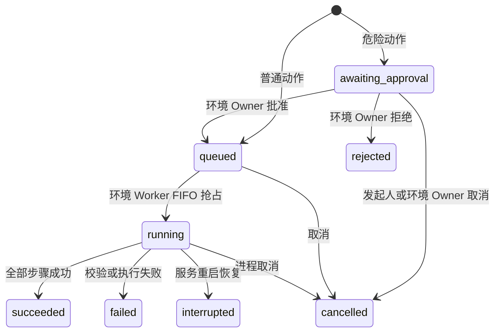

# ClusterForge 平台设计文档（后端为主）

> 文档基线：2026-08-13 当前工作区代码  
> 适用项目：NewPlatform Demo / ClusterForge 交付编排中心  
> 实现状态说明：本文描述当前代码已经实现的行为；“演进建议”不属于现有能力。

## 1. 文档目的

本文面向后端开发、测试、运维和平台设计人员，说明平台的设计目标、领域模型、数据模型、权限边界、关键执行链路、Ansible 安全机制、接口和运行约束。

平台用于管理三类资产：

- 组件：独立安装或升级的软件能力及其不可变发布版本。
- 场景：将精确组件版本组成有向无环图（DAG）的交付流程。
- 环境：Inventory、环境事实、普通参数和凭据引用的版本化集合。

平台将资产定义与运行实例分离。每次运行会锁定组件 Release、场景 Revision、环境 Revision、运行参数和 Playbook 摘要，避免排队期间配置变化改变执行内容。

## 2. 设计目标与边界

### 2.1 当前目标

- 将 Kubernetes、OpenFuyao 等安装作业拆分为可独立维护的组件。
- 用精确 Release ID 表达组件依赖，避免“自动漂移到最新版本”。
- 用 DAG 表达组件执行顺序，并在运行前校验依赖和拓扑。
- 用环境 Revision 固化 Inventory、环境事实和参数。
- 对破坏性动作执行环境 Owner 审批。
- 同一环境按照 FIFO 串行执行，避免多个作业同时改写目标环境。
- 持久化运行、步骤、日志、审批、通知和审计记录。
- 对路径、凭据、运行快照和日志执行后端安全控制。

### 2.2 当前非目标

当前实现是单机本地 Demo，不是生产控制面：

- 身份切换没有密码、SSO、OIDC 或外部 IAM。
- 只有单个 Go 进程和 SQLite，不支持多实例协调或分布式锁。
- SSE 是进程内尽力通知，不是持久消息总线。
- 没有密钥管理系统；只保存环境变量名或 SSH 私钥绝对路径。
- 没有租户、项目、组织、细粒度授权策略和审批流配置。
- 没有定时任务、自动重试、断点续跑或自动回滚。
- OpenFuyao 和 Kubernetes 1.17.5 模板仍需真实主机、介质、网络和安全验收。

## 3. 总体架构



### 3.1 技术栈

| 层次 | 当前实现 |
| --- | --- |
| HTTP 服务 | Go 1.25 标准库 `net/http` |
| 领域与服务 | Go，按 domain / service 分层 |
| 持久化 | SQLite，`modernc.org/sqlite` |
| 作业执行 | 外部 `ansible-playbook` 进程 |
| 前端 | React、TypeScript、Vite |
| 实时提示 | Server-Sent Events（SSE） |
| 静态交付 | 开发时 Vite；构建后嵌入 Go 二进制 |

### 3.2 后端包职责

| 目录 | 职责 |
| --- | --- |
| `cmd/server` | 配置加载、数据库初始化、seed、Runner 和 HTTP 服务生命周期 |
| `internal/domain` | 领域对象、枚举、状态、图校验和通用错误 |
| `internal/service` | RBAC、Owner 校验、业务状态转换、参数解析、作业规划和调度 |
| `internal/store` | SQLite migration、查询、事务、并发状态抢占和持久化 |
| `internal/api` | Cookie 会话、REST/SSE 路由、DTO、可见性过滤和统一错误 |
| `internal/ansible` | 路径约束、摘要、工作区快照、Ansible 子进程、取消和日志脱敏 |
| `internal/seed` | 幂等写入演示身份、组件、场景和环境 |
| `internal/ui` | 开发/嵌入两种静态资源处理 |

## 4. 领域模型



### 4.1 用户与角色

系统定义三种固定角色：

- `component_owner`：维护自己拥有的组件和 Release。
- `scenario_owner`：维护自己拥有的场景和 Revision。
- `environment_owner`：维护自己拥有的环境，审批该环境上的危险运行。

当前 seed 包含两个组件 Owner、一个场景 Owner 和一个环境 Owner。会话令牌只在 Cookie 中返回，数据库保存令牌 SHA-256 摘要，会话有效期为 24 小时。

### 4.2 组件与 Release

`Component` 是稳定的业务标识；名称、slug、说明和下列分类元数据可修改：

- `layer`：L1-L6 对应的主机基础、运行时与状态、编排核心、集群服务、可观测管理和平台扩展层。
- `category`：组件的逻辑能力类别；后端校验类别与层级是否匹配，`network` 可用于 L3 kube-proxy 或 L4 CNI。
- `kind`：`software`、`software_bundle`、`delivery_stage`、`configuration` 或 `artifact_set`。
- `requiredness`：`core_required`、`profile_required` 或 `optional`。

`Component.kind` 描述逻辑组件形态，`ComponentRelease.type` 独立表示 `atomic` 或 `bundle` 交付类型。`ComponentRelease` 表示具体版本：

- 类型：`atomic` 或 `bundle`。
- 状态：`draft -> released -> deprecated`。
- 属性：发布说明、Breaking 标记、验证标记、风险等级、环境约束和结构化参数合同。
- 参数：每个参数必须声明 `name`、`description`、`type` 和 `visibility`（`internal` 或 `public`）。敏感值继续使用 CredentialRef，不能作为普通参数或公开参数。
- 依赖：锁定上游 `componentId + releaseId`，并可声明 `parameterMappings`，下游只能引用上游公开参数。
- 动作：`inspect`、`preflight`、`install`、`configure`、`verify`、`upgrade`、`rollback`、`uninstall`。

Released Release 不可修改；更新时从已有版本克隆新 Draft。修改 Draft 的动作、依赖、约束或参数后，`verified` 会重置为 `false`。

场景节点锁定 Release，但 Release 在图中不要求唯一。同一 Docker、Distribution、Flannel、kubelet 或 kube-proxy Release 可以分别用于 `k8smaster` 与 `k8snode`；依赖成立的条件是至少存在一个锁定指定上游 Release 且可达的节点。

组件测试优先选择 `upgrade`，不存在时选择 `install`，随后在定义了 `verify` 时追加验证步骤。测试成功且测试时锁定的 Release 规格摘要仍与当前 Draft 一致，才会把该 Release 标记为已验证。平台允许发布未验证的组件版本，但会在界面上明确提示风险。

每个 `ActionDefinition` 可以声明 `requiredCredentials`。该列表只保存
CredentialRef 名称并进入 Release 规格摘要；不保存引用目标或凭据值。组件或
场景运行在创建队列项之前，会汇总锁定动作的列表并确认环境 Revision 已声明
所有同名 CredentialRef。

### 4.3 场景与 Revision

`Scenario` 是稳定标识；`ScenarioRevision` 保存 DAG 和执行策略：

- 状态：`draft -> testing -> test_passed -> released -> deprecated`。
- DAG 节点锁定一个组件 Release、一个动作、目标主机组、节点参数、环境参数绑定、允许的运行输入，以及多来源时的 `dependencySources`。
- DAG 边表达执行先后关系。

场景面板按组件层级分组并在节点上显示层级标签，但 `ScenarioNode` 不锁定分类元数据。分层不参与调度，不自动生成边；真实执行顺序只由 Release 依赖和 DAG 边决定。

图校验包括：

- 图不能为空，节点 ID 唯一。
- 每个节点必须锁定 Release、动作和主机组。
- 同一 Release 可以在不同主机组或生命周期动作中重复出现。
- 边的源和目标必须存在，图中不能有环。
- 节点只能使用已发布 Release；已发布场景可继续引用已废弃但保留的 Release。
- 节点动作必须由对应 Release 定义。
- Release 所需参数必须有默认值、节点值、环境绑定、声明的运行输入，或来自上游映射。
- 上游依赖 Release 必须出现在图中，而且在拓扑上先于下游节点。
- 带参数映射的依赖：只有一个可达上游节点时自动绑定；多个可达节点时必须在 `dependencySources` 中明确选择。
- 映射目标不得同时出现在节点值、环境绑定或 Run Input 中。

环境绑定先查找完整顶层键，再把 `operation.cluster_id` 视为点路径逐层读取；
因此旧的扁平键继续有效，新的环境模板可以保存分组参数。`verify` 节点观察的
是环境中已存在的 Release，不要求在同一场景中重新执行该 Release 的安装期
依赖；后续写动作仍可通过 DAG 边依赖这个只读验证节点。

只有当前 Revision 可以编辑和测试。完整测试成功后进入 `test_passed`，再次校验通过才能发布。Released Revision 不可修改，后续变更必须创建新 Revision。

### 4.4 环境与 Revision

`EnvironmentRevision` 包含：

- Facts：架构、操作系统、网络等兼容性事实。
- Inventory：主机名、地址、分组、SSH 用户和端口。
- Parameters：可持久化的非敏感环境参数。
- CredentialRefs：`envVarRef` 或 `sshKeyPath`。
- `maxConcurrent`：当前结构保留该字段，但调度实现固定按每环境一个运行串行执行。

每次保存 Inventory、Facts、Parameters 或 CredentialRefs 都会创建新 Environment Revision。已创建的 Run 继续引用旧 Revision，不会被后来修改影响。

### 4.5 Run、Step、Approval 与 Log

Run 类型：

- `component_test`：组件版本环境测试。
- `scenario_test`：场景 Draft 的完整测试。
- `scenario_run`：已发布场景的正式运行入口。

Run 状态：



每个场景节点先执行节点动作；若动作不是 `verify` 且 Release 定义了 `verify`，Planner 会追加验证步骤。Rollback 后的验证使用目标旧 Release 的验证动作和参数合同。

## 5. 数据模型

SQLite 主要表如下：

| 表 | 作用 | 关键约束 |
| --- | --- | --- |
| `users` | 演示用户 | 角色枚举约束 |
| `sessions` | Cookie 会话摘要 | token hash 主键、过期时间 |
| `components` | 组件元数据与分类 | slug 唯一、Owner 外键、layer/category/kind/requiredness 枚举约束 |
| `component_releases` | 组件版本 | `(component_id, version)` 唯一 |
| `component_dependencies` | 精确上游依赖 | 每个下游 Release 对同一上游组件唯一 |
| `action_definitions` | Ansible 生命周期动作 | Release 外键 |
| `scenarios` | 场景元数据 | slug 唯一、current Revision 指针 |
| `scenario_revisions` | DAG 与策略 | `(scenario_id, revision)` 唯一 |
| `environments` | 环境元数据 | current Revision 指针 |
| `environment_revisions` | 环境快照 | `(environment_id, revision)` 唯一 |
| `runs` | 运行主记录和锁定快照 | 环境、组件/场景 Revision 外键 |
| `run_steps` | 实际执行步骤 | Run 删除时级联 |
| `run_logs` | 持久日志 | 按 Run 和自增 ID 查询 |
| `approvals` | 危险运行审批 | 每个 Run 最多一条 |
| `notifications` | 用户站内通知 | 用户维度查询和已读时间 |
| `audit_events` | 审计记录 | 数据库触发器禁止更新和删除 |

时间统一以 UTC RFC3339Nano 文本保存。JSON 结构存入 TEXT 字段，包括参数合同、映射、约束、DAG、Inventory、环境参数、CredentialRefs 和运行快照。`component_releases.parameters_json` 与 `component_dependencies.parameter_mappings_json` 为首版合同，不保留旧 `parameterSchema`。

## 6. 权限和可见性

### 6.1 写权限矩阵

| 能力 | 组件 Owner | 场景 Owner | 环境 Owner |
| --- | --- | --- | --- |
| 创建/修改组件 | 仅本人组件 | 否 | 否 |
| 创建/配置/发布组件 Release | 仅本人组件 | 否 | 否 |
| 发起组件测试 | 仅本人组件 | 否 | 可以 |
| 创建/编排/发布场景 | 否 | 仅本人场景 | 否 |
| 发起场景测试或运行 | 否 | 仅本人场景 | 可以 |
| 创建/修改环境 Revision | 否 | 否 | 仅本人环境 |
| 审批危险 Run | 否 | 否 | 仅本人环境上的 Run |
| 取消 Run | 本人发起 | 本人发起 | 本人环境上的 Run |
| 查看审计 API | 否 | 否 | 可以 |

服务层同时校验角色和资源 Owner，前端按钮隐藏不是权限边界。

### 6.2 读可见性

- 组件 Owner 可见自己的全部 Release；其他用户只看已发布 Release。
- 场景 Owner 可见自己的全部 Revision；其他用户只看已发布 Revision。
- 所有登录角色可浏览环境；CredentialRef 只有对应环境 Owner 能看到引用字符串，其他角色只看到是否已配置。
- Run 对发起人、环境 Owner、相关场景 Owner以及锁定步骤涉及的组件 Owner可见。
- 通知仅对接收用户可见。
- Run/Approval SSE 事件按相同 Run 可见性过滤。

## 7. 关键后端流程

### 7.1 组件发布与影响通知

1. 组件 Owner 配置 Draft。
2. 后端校验版本、依赖、动作、敏感参数和 Playbook 路径。
3. Upgrade/Rollback 必须显式锁定同组件的正确起止 Release。
4. 上游依赖必须是已发布 Release，且不能在组件依赖图中形成环。
5. 计算反向依赖的直接和传递影响，并查找引用受影响组件的场景。
6. Release 进入 Released。
7. 为下游组件 Owner 和场景 Owner生成站内通知。
8. 追加审计事件并发送 SSE 刷新信号。

通知只提示影响，不会自动修改下游锁定版本或场景 DAG。

### 7.2 参数解析

节点先按自身合同解析，再应用依赖映射。自身优先级从低到高为：

1. Release 参数默认值。
2. 场景节点 `values` 与环境绑定。
3. Environment Revision 的同名 Parameters，以及尚未被节点值/绑定占用的 `environmentPath`。
4. 本次 Run Input。

随后按 DAG 拓扑把上游节点**本次运行的最终值**写入映射目标。映射值不可被本地覆盖；同名环境参数对映射目标不生效。支持 A → B → C 连续传递。传给 Ansible 的 extra-vars 只用下游参数名。

组件独立测试不能读取上游节点，必须通过 `dependencyFixtures` 提供映射目标；API 不会用上游默认值静默补全。Fixture 只证明组件能消费参数，不能替代场景完整测试。

首版只传递运行前可解析的配置值，不支持 Playbook 执行后动态输出，也不读取历史 Run。

Run Input 只能覆盖节点或动作显式声明允许的键。解析后校验必填、类型、enum 和 minLength。Upgrade/Rollback 发布时要求起止 Release 的映射合同一致。

### 7.3 Run 规划与不可变快照

创建 Run 时，后端执行：

- 校验发起权限、Release/Revision 状态、场景 DAG 和环境约束。
- 按 DAG 拓扑排序生成步骤。
- 校验目标 Host Group 在当前 Inventory 中存在。
- 汇总锁定动作的 `requiredCredentials`，缺少任一 CredentialRef 时在排队前失败。
- 锁定每个步骤的 Release ID、动作、Playbook、tags、limit、变量和超时。
- 计算 Playbook 文件 SHA-256 和允许目录树摘要。
- 记录 Component Release 规格摘要、环境 Revision ID、步骤所需凭据名称和脱敏 CredentialRefs。
- 判断是否需要审批并持久化 Run。

### 7.4 危险动作审批

满足任一条件即需要审批：

- 动作显式 `destructive=true`。
- 风险等级为 `destructive`。
- 动作类型、名称或 Playbook 路径包含 recovery、clean、destroy、uninstall、`rcv` 等标记。

危险 Run 初始为 `awaiting_approval`。只有目标环境的 Owner 能批准或拒绝；批准后进入 `queued`，拒绝后进入 `rejected`。审批记录与审计记录都会持久化。

### 7.5 环境 FIFO 调度

- 每个环境对应一个进程内 Worker。
- Worker 使用数据库事务检查该环境是否已有 Running Run。
- 按 `created_at` 领取最早的 Queued Run，并原子更新为 Running。
- 当前 Run 结束后继续领取下一个。
- 不同环境可以由不同 goroutine 并行执行。
- 服务启动时恢复已有 Queued Run；重启前处于 Running 的 Run 被标记为 Interrupted。

`maxConcurrent` 虽然存储在 Environment Revision 中，但当前调度逻辑没有使用该值扩展并发度。

`ExecutionPolicy` 会随 Scenario Revision 持久化，但当前 Planner 尚未执行其中的 `failurePolicy`、`maxUnavailableNodes` 等策略；实际行为仍是拓扑串行、遇到首个失败即终止。

### 7.6 Ansible 执行

每个锁定步骤执行三个阶段：

1. `ansible-playbook --syntax-check`
2. `ansible-playbook --list-hosts`
3. `ansible-playbook` 正式执行

任一阶段失败即终止当前步骤和 Run。执行成功后解析 Ansible recap，记录 ok、changed 和主机数摘要。

## 8. Ansible 与凭据安全

### 8.1 路径和制品约束

- 动作只能保存相对 Playbook 路径。
- Runner 将路径限制在允许根目录内，拒绝绝对路径、`..` 穿越和越界符号链接。
- 执行前验证 Playbook 与目录树摘要；排队后源文件变化会阻断执行。
- 每次执行复制一份只包含常规文件的目录树；执行树内禁止符号链接和特殊文件。

### 8.2 临时工作区

- 每次步骤使用独立工作区。
- 工作区和输入目录权限为 `0700`。
- Inventory 和变量文件权限为 `0600`。
- 使用独立 `ANSIBLE_LOCAL_TEMP`。
- 执行完成后删除临时工作区。

### 8.3 CredentialRef

- `envVarRef` 保存后端进程环境变量名，执行时读取实际值。
- `sshKeyPath` 保存绝对路径，执行时校验文件存在。
- 环境事实、普通参数、场景值、运行输入和审计元数据拒绝名称包含 password、secret、token、private key、encryption key、credential 等敏感键。
- 实际 secret 不写入数据库 Run 快照；日志写入前按 secret 字面值脱敏。
- Release 动作的 `requiredCredentials` 只是一组名称。环境中同名引用缺失时，
  组件运行和场景运行都会在创建 Run 之前 fail-closed。

注意：`sshKeyPath` 的路径本身会保存到数据库，私钥内容不会保存。当前 Runner 将该路径作为同名 Ansible 变量传入，是否由 Playbook 用作连接私钥取决于作业定义。

### 8.4 OpenFuyao adapter 边界

原始 105 文件作业快照保持不变。平台自有 adapter 负责合同校验、动态
`target_host_group`、`ansible_user` 到 `ansible_ssh_user` 的兼容桥，以及在
`bke-master` 前重建跨 Playbook 丢失的 registry facts。Seed 提供 cert、
bootstrap、common、addon、master、nodes 六个组件和三个独立场景：管理集群
构建、业务集群控制面构建、业务节点纳管。节点纳管先执行只读 master verify。

管理与业务场景分别固定 `cluster_role=manager|work` 及目标主机组，不开放运行
输入覆盖。环境使用 `operation`、`network`、`versions`、`artifact_sources`、
`certificates`、`addon_params` 分组，再由点路径 Bindings 映射到 Ansible 实际
变量名。callback URL/token、task ID 和旧 wrapper 的
`management_cluster_id` 不属于 Release 参数合同。

### 8.5 日志

- stdout、stderr 和 system 日志进入统一采集器。
- 日志在进入 SQLite 和 SSE 前脱敏。
- 单步骤保留日志受 `NEWPLATFORM_MAX_LOG_BYTES` 限制，超限后写入一条截断标记。
- Run 详情 API 当前最多读取 500 条，再向界面返回末尾 200 条。

## 9. REST API

所有接口使用 `/api/v1` 前缀。除身份切换外，均要求有效会话 Cookie。

### 9.1 会话与事件

| 方法 | 路径 | 作用 |
| --- | --- | --- |
| POST | `/session/switch` | 切换演示身份并创建 24 小时 Cookie |
| GET | `/session/me` | 查询当前身份 |
| GET | `/events` | SSE 事件流 |

### 9.2 组件

| 方法 | 路径 | 作用 |
| --- | --- | --- |
| GET / POST | `/components` | 列表 / 创建组件 |
| GET / PATCH | `/components/{id}` | 详情 / 修改元数据 |
| POST | `/components/{id}/releases` | 创建首个或新 Release Draft |
| PUT | `/component-releases/{id}` | 更新 Draft |
| PUT | `/component-releases/{id}/contract` | 仅替换 Draft 的直接依赖与参数合同，保留动作和其他版本字段 |
| POST | `/component-releases/{id}/clone` | 克隆为新 Draft |
| GET | `/component-releases/{id}/impact` | 发布影响预览 |
| POST | `/component-releases/{id}/publish` | 发布 |
| POST | `/component-releases/{id}/deprecate` | 废弃 |
| POST | `/component-releases/{id}/test-runs` | 发起组件测试 |

### 9.3 场景

| 方法 | 路径 | 作用 |
| --- | --- | --- |
| GET / POST | `/scenarios` | 列表 / 创建场景 |
| GET | `/scenarios/{id}` | 场景详情 |
| POST | `/scenarios/{id}/revisions` | 克隆新 Revision |
| PUT | `/scenario-revisions/{id}/graph` | 保存 DAG 和策略 |
| POST | `/scenario-revisions/{id}/validate` | 校验 DAG |
| POST | `/scenario-revisions/{id}/test-runs` | Draft 完整测试 |
| POST | `/scenario-revisions/{id}/runs` | 运行 Released Revision |
| POST | `/scenario-revisions/{id}/publish` | 发布测试通过的 Revision |
| POST | `/scenario-revisions/{id}/deprecate` | 废弃 Revision |

### 9.4 环境、运行和治理

| 方法 | 路径 | 作用 |
| --- | --- | --- |
| GET / POST | `/environments` | 列表 / 创建环境 |
| PUT | `/environments/{id}/inventory` | 新建包含 Inventory 变更的 Revision |
| PUT | `/environments/{id}/facts` | 新建包含 Facts 变更的 Revision |
| PUT | `/environments/{id}/parameters` | 新建包含参数变更的 Revision |
| PUT | `/environments/{id}/credential-refs` | 新建包含凭据引用变更的 Revision |
| GET | `/runs` | 查询当前用户可见 Run |
| GET | `/runs/{id}` | Run 步骤、审批和日志详情 |
| POST | `/runs/{id}/cancel` | 取消等待、排队或运行中的 Run |
| POST | `/approvals/{id}/approve` | 批准危险 Run |
| POST | `/approvals/{id}/reject` | 拒绝危险 Run |
| GET | `/notifications` | 当前用户通知 |
| PATCH | `/notifications/{id}` | 标记已读；不能恢复未读 |
| GET | `/audit-events` | 最近 500 条审计，仅环境 Owner |

成功响应使用 `{ "data": ... }` 或 `{ "items": [...] }`。错误统一为：

```json
{
  "error": {
    "code": "invalid_request",
    "message": "scenario validation failed",
    "details": []
  }
}
```

错误码映射为 `unauthorized`、`forbidden`、`not_found`、`conflict`、`invalid_request` 和 `internal_error`。

## 10. 实时事件、通知与审计

EventHub 提供进程内、非阻塞、尽力而为的 SSE fan-out。客户端收到事件后重新调用 REST 获取权威状态。慢客户端可能丢失事件；SQLite 始终是事实来源。

主要事件包括：

- `run.updated`
- `run.log`
- `approval.updated`
- `release.published`
- `scenario.published`
- `notification`

审计事件采用 append-only 设计，服务不提供修改/删除入口，SQLite 触发器也拒绝 UPDATE 和 DELETE。审计写入失败目前不会让主要业务操作回滚，因此它是 Demo 级辅助记录，不是强事务合规审计。

## 11. 配置与启动

| 变量 | 默认值 | 说明 |
| --- | --- | --- |
| `NEWPLATFORM_ADDR` | `127.0.0.1:8080` | HTTP 地址 |
| `NEWPLATFORM_DB_PATH` | `./data/newplatform.db` | SQLite 文件 |
| `NEWPLATFORM_ANSIBLE_BIN` | `ansible-playbook` | Ansible 命令 |
| `NEWPLATFORM_RUN_ROOT` | `./data/runs` | 临时工作区根目录 |
| `NEWPLATFORM_ALLOWED_ANSIBLE_ROOTS` | `./examples/ansible` | 允许目录；当前 Runner 使用第一个配置项 |
| `NEWPLATFORM_KILL_GRACE` | `3s` | 取消后的进程组终止宽限期 |
| `NEWPLATFORM_MAX_LOG_BYTES` | `2097152` | 单步骤日志上限 |
| `NEWPLATFORM_SEED_PROFILE` | `demo` | `identities` 时仅保留角色身份，不导入 Demo 目录数据 |
| `NEWPLATFORM_IMAGE_REGISTRY` | 无 | Draft Dockerfile 构建的目标 Registry；空值禁用功能 |
| `NEWPLATFORM_IMAGE_BUILD_ROOT` | `./data/image-builds` | Dockerfile 临时构建上下文根目录 |
| `NEWPLATFORM_DOCKER_BIN` | `docker` | Docker CLI 路径 |
| `NEWPLATFORM_K8S1175_ENCRYPTION_KEY` | 无 | K8s 1.17.5 示例执行时动态注入的 secret |

启动过程：加载 `.env`（不覆盖已有进程环境变量）→ 打开并迁移数据库 → 幂等 seed → 初始化 Runner → 恢复运行状态和队列 → 启动 HTTP 服务。

## 12. 故障恢复与一致性

- 服务重启时，Running Run 和 Running Step 变为 Interrupted。
- 被中断的 Scenario Test 会把 Revision 从 Testing 退回 Draft。
- 已排队 Run 在启动时重新调度。
- 排队 Run 使用锁定的 Environment Revision，不切换到最新环境。
- Playbook 摘要不匹配时阻断执行，不自动接受新内容。
- 取消 Running Run 使用 context 取消并终止 Ansible 进程组；不保证撤销已经对目标主机完成的变更。
- SQLite 事务保护 Run 抢占、审批决策和 Revision 指针更新等关键状态修改。
- 组件发布、影响通知和审计目前不是一个跨表强事务：Release 状态先更新，后续通知失败时接口可能返回错误但 Release 已发布；生产化前应把发布、通知 outbox 和审计纳入一致性设计。

## 13. 测试与构建门禁

| 命令 | 覆盖范围 |
| --- | --- |
| `make test` | Go 单元/接口/存储测试、前端 Vitest、真实 localhost Ansible 生命周期 |
| `make test-e2e` | Playwright 关键界面流程 |
| `make build` | 构建前端并嵌入 Go 二进制 |
| `go test -race ./...` | Go 数据竞争检查（独立执行） |
| `go vet ./...` | Go 静态检查（独立执行） |

包级测试通过不等同于 OpenFuyao 或 Kubernetes 真实环境验收。真实交付还必须验证 Inventory、介质版本和校验和、仓库可达性、主机前置条件、凭据、网络和回退方案。

## 14. 当前限制与演进建议

以下是建议，不代表当前已实现：

- 接入 OIDC/SSO、CSRF 防护、Secure Cookie 和外部 IAM。
- 从 SQLite/单实例 Worker 演进为数据库锁或消息队列驱动的多实例调度。
- 接入 Vault/KMS，避免用后端进程环境变量或本地路径承载 secret 引用。
- 将执行策略真正接入 Planner，例如并行分支、失败策略和最大不可用节点。
- 增加审批理由必填、多人审批、超时和审批策略模板。
- 增加审计强事务、导出、保留期和不可抵赖存储。
- 增加 Run 重试、从失败节点恢复和人工确认后的显式回滚流程。
- 增加 OpenAPI、分页、过滤、幂等键和 API 版本兼容策略。
