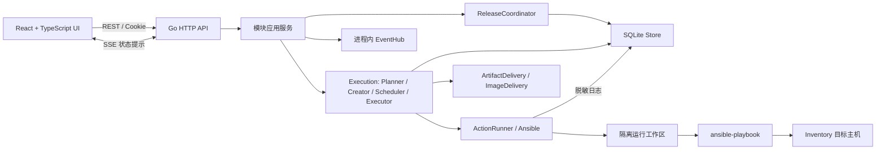
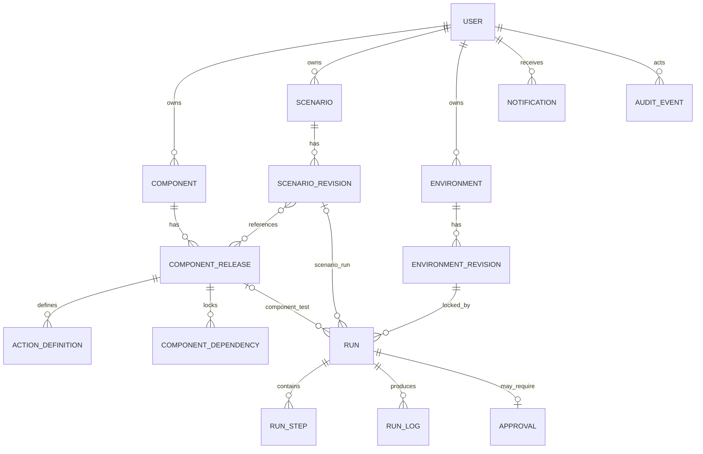
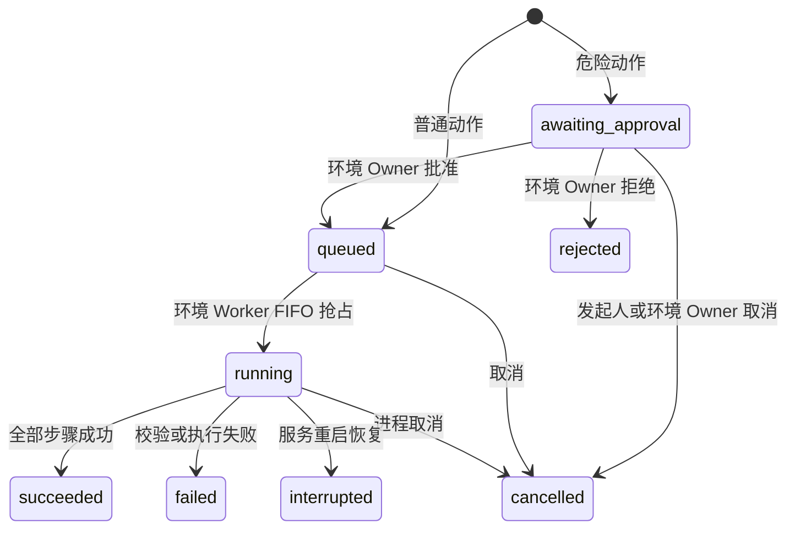

# ClusterForge 平台设计文档（后端为主）

> 版本与环境：本文属于项目首个版本（V1）；当前环境是测试环境，不是生产环境。V1 只接受当前数据库与 API 合同，不提供历史迁移、旧字段或双合同兼容；其他合同失败关闭。统一规则见 [首版与环境策略](version-policy.md)。

> 文档基线：2026-08-30 当前工作区代码
> 适用项目：NewPlatform Demo / ClusterForge 交付编排中心
> 实现状态说明：本文描述当前代码已经实现的行为；“演进建议”不属于现有能力。

## 1. 文档目的

本文面向后端开发、测试、运维和平台设计人员，说明平台的设计目标、领域模型、数据模型、权限边界、关键执行链路、Ansible 安全机制、接口和运行约束。

平台用于管理三类资产：

- 组件：独立安装或升级的软件能力及其不可变发布版本。
- 场景：将精确组件版本组成有向无环图（DAG）的交付流程。
- 环境：Inventory、环境事实、组件环境参数、受治理变量和凭据引用的版本化集合。

平台将资产定义与运行实例分离。每次运行会锁定组件 Release、场景 Revision、环境 Revision、解析后的结构化参数和 Playbook 摘要，避免排队期间配置变化改变执行内容。

## 2. 设计目标与边界

### 2.1 当前目标

- 将 Kubernetes 等安装作业拆分为可独立维护的组件。
- 用精确 Release ID 表达组件依赖，避免“自动漂移到最新版本”。
- 用 DAG 表达组件执行顺序，并在运行前校验依赖和拓扑。
- 用环境 Revision 固化 Inventory、环境事实和参数。
- 对破坏性动作执行环境 Owner 审批。
- 同一环境按照 FIFO 串行执行，避免多个作业同时改写目标环境。
- 持久化运行、步骤、日志、审批、通知和审计记录。
- 对路径、凭据、运行快照和日志执行后端安全控制。

### 2.2 当前非目标

当前实现是单机本地 Demo，不是生产控制面：

- 身份切换没有密码、SSO、OIDC 或外部 IAM。
- 只有单个 Go 进程和 SQLite，不支持多实例协调或分布式锁。
- SSE 是进程内尽力通知，不是持久消息总线。
- 没有密钥管理系统；只保存环境变量名或 SSH 私钥绝对路径。
- 没有租户、项目、组织、细粒度授权策略和审批流配置。
- 没有定时任务、自动重试或自动回滚；仅支持指纹未变且首个未完成动作明确安全时的人工续跑。
- Kubernetes 目录资产仍需真实主机、介质、网络和安全验收。

## 3. 总体架构



### 3.1 技术栈

| 层次 | 当前实现 |
| --- | --- |
| HTTP 服务 | Go 1.25 标准库 `net/http` |
| 领域与服务 | Go，按 domain / service 分层 |
| 持久化 | SQLite，`modernc.org/sqlite` |
| 作业执行 | 外部 `ansible-playbook` 进程 |
| 前端 | React、TypeScript、Vite |
| 实时提示 | Server-Sent Events（SSE） |
| 静态交付 | 开发时 Vite；构建后嵌入 Go 二进制 |

### 3.2 后端包职责

| 目录 | 职责 |
| --- | --- |
| `cmd/server` | 配置加载、数据库初始化、seed、Runner 和 HTTP 服务生命周期 |
| `internal/domain` | 领域对象、枚举、状态、图校验和通用错误 |
| `internal/service` | RBAC、Owner 校验、业务状态转换、参数解析、作业规划和调度 |
| `internal/store` | SQLite 首版结构初始化、合同校验、查询、事务、并发状态抢占和持久化 |
| `internal/api` | Cookie 会话、REST/SSE 路由、DTO、可见性过滤和统一错误 |
| `internal/ansible` | 路径约束、摘要、工作区快照、Ansible 子进程、取消和日志脱敏 |
| `internal/seed` | 幂等写入演示身份、组件、场景和环境 |
| `internal/ui` | 开发/嵌入两种静态资源处理 |

`Platform` 只负责静态装配和向旧调用方提供兼容门面。HTTP API 通过
`CatalogService`、`ScenarioService`、`EnvironmentService`、
`ExecutionService`、`ReleaseCoordinator` 和只读服务访问业务能力，不取得
`Store` 或数据库连接。各服务的查询依赖声明为窄 Store 接口。

Execution 内部按职责分为 `PlanBuilder`、`RunCreator`、`RunScheduler`、
`RunExecutor`、`LifecycleRecorder`、`RollbackPlanner` 和 `ApprovalService`。
Planner 不写库，Executor 只消费锁定快照，生命周期证据由 Recorder 记录。
场景联合发布和组件单独发布统一由 `ReleaseCoordinator` 复核门禁；Scenario
模块不能直接更新 Component Release。

工具差异通过启动时静态装配的三个端口隔离：`ActionRunner`、
`ArtifactDelivery`、`ImageDelivery`。当前实现分别是 Ansible Runner、HTTP/FSS
介质适配器和 Docker/OCI 镜像适配器，不包含运行时插件发现或动态加载。

## 4. 领域模型



### 4.1 用户与角色

系统定义四种固定角色：

- `component_owner`：维护自己拥有的组件和 Release。
- `scenario_owner`：维护自己拥有的场景和 Revision。
- `environment_owner`：维护自己拥有的环境，审批该环境上的危险运行。
- `platform_admin`：维护平台选项目录、全局环境字段和环境变量字段，审核 Component Release 合同；对业务资源全局只读。

全局环境字段可有可无 `defaultValue`。默认值存放在独立的 `environment_parameter_defaults` 表，与字段一起校验和审计。该表属于当前完整数据库和 Catalog 合同。环境保存事务使用当前目录补齐缺失的默认值，并在参数保存时拒绝未填全局字段；默认值写入 Environment Revision，运行只读取锁定快照。已有环境覆盖值、精确恢复和历史 Run 不随平台默认值变化。Git Catalog 携带被保留组件引用的默认值；缺少默认值表的 Catalog 会被拒绝，平台不转换历史格式。

当前 seed 包含两个组件 Owner、一个集群 Owner 和一个环境 Owner。会话令牌只在 Cookie 中返回，数据库保存令牌 SHA-256 摘要，会话有效期为 24 小时。

### 4.2 组件与 Release

`Component` 是稳定的业务标识；名称、slug、说明和下列轻量分类元数据可修改：

- `layer`：L1-L6 对应的主机基础、运行时与状态、编排核心、集群服务、可观测管理和平台扩展层。
- `tags`：少量自由标签，只参与检索和展示，不参与调度或依赖推导。

`ComponentReleaseLine` 表示一条独立安装基线及其线性演进关系。名称只用于展示，可修改且记录审计；稳定关系始终使用 `lineId`。每条线最多一个有效 Draft，每个 Released 版本最多一个直接后继。没有显式转换边的版本属于不同发布线，例如 Kubernetes 1.17 与 1.34 默认互不构成升级关系。

`ComponentRelease` 表示发布线上的具体版本；是否包含多个动作、介质或镜像由实际内容表达，不再保存 `atomic/bundle` 类型：

- 状态：未发布版本支持 `draft -> deprecated -> draft`；已发布版本支持 `draft -> released -> deprecated`。只有 `released_at IS NULL` 的 Deprecated Release 可以恢复为 Draft 或进入永久删除门禁。
- 关系：`parentReleaseId` 只表示同一发布线的升级来源；`templateSourceReleaseId` 只表示复制来源，不建立升级关系。
- 兼容性：新发布线根版本固定为 `not_applicable`；演进版本必须选择 `compatible` 或 `breaking`。兼容性与 Action 的 `riskLevel` 独立。
- 属性：发布说明、风险等级、环境约束和结构化参数合同。
- 审核与候选交接：所有 Draft（包括无参数 Release）先由组件 Owner 提交审核；平台 Owner 批准的摘要必须仍与当前合同一致，才能设置 `candidate=true` 或发布。参数、依赖映射、Action、环境绑定或 Playbook 内容发生变化时，审核和候选状态立即失效。
- 参数：每个参数必须声明 `name`、`description`、`type`、`visibility`、`modifiable` 和 `valueProvider`。`visibility` 只决定能否被下游映射；`valueProvider` 才决定由组件、场景、环境或上游映射提供值。敏感值继续使用 CredentialRef。
- 依赖：锁定上游 `componentId + releaseId`，并可声明 `parameterMappings`，下游只能引用上游公开参数。Draft 编辑期可锁定同一组件 Owner 的私有 Draft，便于按 DAG 导入；跨 Owner 只能锁定 Released 或已共享且 Readiness 未阻断的候选 Draft。候选交接和发布仍会重新执行更严格的状态检查。
- 动作：`inspect`、`preflight`、`install`、`configure`、`verify`、`upgrade`、`rollback`、`uninstall`。
- `install` 动作可以显式声明 `idempotent=true`。此时场景节点选择 `upgrade` 会复用同一个 Playbook 和动作合同；若 Release 另有显式 `upgrade`，仍优先使用显式动作。

Released Release 不可修改。创建 Draft 必须先预览并提交 `expectedPlanDigest`，并明确选择“创建全新发布线”或“基于发布线演进”。全新发布线可以空白创建，也可以把同组件 Released/Deprecated Release 当作模板；模板复制会清除 Upgrade 以及 Rollback 的旧版本绑定。演进只能基于该线最后一个曾发布且当前仍为 Released 的版本，并且该父版本不得已有活动或曾发布后继；若末代曾发布版本已 Deprecated，该线关闭演进入口，只能创建新发布线。平台自动继承发布线和合同，并把 Upgrade 重写为“父版本 → 新版本”、Rollback 重写为“新版本 → 父版本”。复制提交把 Release、依赖、Action、介质/镜像内容身份和审计放在同一 SQLite 事务；托管 Playbook 先通过 manifest 暂存并提升，事务失败时清理，进程中断后由启动恢复依据目标 Release 是否落库决定保留或删除。修改 Draft 的动作、依赖、约束、参数、内容身份或 Playbook 内容摘要后，既有证据因规格摘要不匹配而自然失效。

未发布 Draft 可随时废弃，即使已经产生或正在产生验证 Run；废弃只关闭编辑与候选共享，不删除合同或证据。未发布的 Deprecated Release 可恢复为 Draft，但同一发布线已有其他 Draft、或同一父版本已有其他有效后继时恢复失败关闭。永久删除仅接受从未发布且已废弃的 Release；事务内再次确认不存在组件/场景 Run、镜像构建、下游依赖、场景 Revision 引用、其他 Release/Action 合同引用或环境安装记录，然后删除 Release 自有合同数据及空发布线，并保留 `component_release.deleted` 审计。已发布版本永不物理删除。

参数 `type` 只允许 `string`、`boolean`、`integer`、`number`、`object` 和 `array`；`fixedValue`、`suggestedValue`、`testValue`、`enum` 与 `minLength` 必须和类型一致。合法提供方组合为：组件固定值必须不可修改并填写 `fixedValue`；场景和环境字段必须可修改且不得固定；上游映射必须不可修改并存在唯一映射。环境字段还必须声明私有绑定，或引用平台 Owner 维护的全局字段。分配给场景或环境 Owner 的 `object`、`array` 字段必须提供受控枚举，由界面生成选择控件，禁止退化为原始 JSON 编辑。`suggestedValue` 只供 Owner 显式采用，绝不自动生效。

场景节点锁定 Release，但同一 Component 在图中不要求唯一。若同一软件需要投放到 `k8smaster` 与 `k8snode`，组件 Owner 必须建立主机组各自固定的独立发布线；这些发布线可以复用 Playbook 和制品，但每个 Action 的主机组仍属于不可由场景修改的 Release 合同。场景 Owner 只选择精确 Release 和 Action。依赖成立的条件是至少存在一个锁定指定上游 Release 且可达的节点。

安装验证按 `upgrade` → `install` → `configure` → `preflight` → `inspect` 的顺序选择第一个已定义主动作，随后在定义了 `verify` 时追加验证步骤。回滚测试始终执行 Draft 自身的 rollback 合同：带 from/to 的版本回滚必须选择一个同组件的 Released/Deprecated Release 追加其 verify；只有 from/to 都为空、目标为干净状态的清理 rollback 才允许 `rollback_only`。普通 `rollback_only` 仅证明清理动作完成，不能作为候选共享或发布所需的回退后验证证据；清理 rollback 若以动作标签 `clusterforge.rollback-self-verifies` 明确声明 Playbook 内含严格后置验证，则相同内容摘要下成功的 `rollback_only` 可作为回退证据。该标签用于其他 Action 或版本回滚时，Release 合同校验直接拒绝。`clusterforge.` 前缀保留为合同元数据命名空间，执行器不会把这类标签传给 Ansible `--tags`；其余动作标签仍用于选择 Ansible task。

`readiness` 是唯一就绪结论。新基线实时复核 install、verify、无版本绑定的清理型 rollback 及相应成功证据；演进版本要求显式 Upgrade 或幂等 Install、精确回到父版本的 Rollback，以及同一锁定计划完成“父版本安装与验证 → 目标升级与验证 → 回退 → 父版本验证”的闭环证据。Release 声明容器运行时兼容性时，`containerRuntimeVersion` 的每个值都通过父选项形成一条明确组合；Run 快照锁定 Environment Revision 的单一组合，Readiness 必须逐组合取得当前 Release 规格摘要下的安装/验证与回滚/验证证据。Draft 规格摘要变化会让全部旧证据失效。`breaking` 使就绪度显示 `risky`，但不会替代 Action 风险判断。SSE 只负责刷新提示，丢失事件或服务重启不会改变结论。直接发布还要求上游依赖已经 Released；候选链允许依赖其他已共享且 Readiness 未阻断的候选 Draft。

每个 `ActionDefinition` 可以声明 `requiredCredentials`。该列表只保存
CredentialRef 名称并进入 Release 规格摘要；不保存引用目标或凭据值。组件或
场景运行在创建队列项之前，会汇总锁定动作的列表并确认环境 Revision 已声明
所有同名 CredentialRef。

### 4.3 场景与 Revision

`Scenario` 是稳定标识；`ScenarioRevision` 保存静态 DAG：

- 状态：`draft -> testing -> test_passed -> released -> deprecated`。
- DAG 节点锁定一个组件 Release、一个动作、只读主机组快照、结构化 `parameterValues`，以及多来源时的 `dependencySources`。主机组由 Release Action 派生，场景写接口不接受该字段。
- DAG 边表达执行先后关系。

场景面板按组件层级分组并在节点上显示层级标签，但 `ScenarioNode` 不锁定分类元数据。分层不参与调度，不自动生成边；真实执行顺序只由 Release 依赖和 DAG 边决定。

图校验包括：

- 图不能为空，节点 ID 唯一。
- 每个节点必须锁定 Release、动作和主机组。
- 同一 Release 可以重复出现，但每个节点的主机组必须等于所选 Action 的合同值；目标主机组不同的同组件节点必须选择组件 Owner 提供的不同发布线。
- 边的源和目标必须存在，图中不能有环。
- 可编辑 Revision 的节点只能使用 Released Release 或组件 Owner 已共享且证据仍有效的候选 Draft；已发布场景可继续引用已废弃但保留的 Release。
- 节点动作必须由对应 Release 定义；唯一的能力映射是 `idempotent=true` 的 `install` 可同时满足 `upgrade`。
- 集群 Owner 只能填写 `modifiable=true` 且 `valueProvider=scenario_owner` 的已定义字段；未知字段、环境字段、固定值或映射目标均拒绝。
- 上游依赖 Release 必须出现在图中，而且在拓扑上先于下游节点。
- 带参数映射的依赖：只有一个可达上游节点时自动绑定；多个可达节点时必须在 `dependencySources` 中明确选择。
- 每个 `upstream_mapping` 目标必须且只能存在一条映射；正式运行从可达上游节点取最终值。

`verify` 节点观察的是环境中已存在的 Release，不要求在同一场景中重新执行该
Release 的安装期依赖；后续写动作仍可通过 DAG 边依赖这个只读验证节点。

只有当前 Revision 可以编辑和测试。完整测试成功后，Recorder 会在同一事务中重读 Run 锁定步骤，只有 DAG 摘要以及每个 `releaseSpecDigest` 都仍匹配当前定义时才进入 `test_passed`；否则回到 Draft。发布前再次计算候选集并复核各 Release 合同与证据。场景 Revision 和引用的全部候选 Release 在同一事务中发布，任一候选变化都会整体失败。Test Passed、Released 与 Deprecated Revision 都不可修改；需要修正或演进时克隆新 Draft，并保留原 Revision 与历史 Run。

### 4.4 环境与 Revision

`EnvironmentRevision` 包含：

- Facts：架构、操作系统、操作系统版本、网络，以及联动必填的单一 `containerRuntime` / `containerRuntimeVersion` 组合。版本技术值包含父运行时身份，例如 `docker@20.10.21`。
- Inventory：主机名、地址、分组、SSH 用户和端口。
- Variables：由环境 Owner 维护的非敏感字符串环境变量；使用大写标识符名称并直接注入 Ansible extra-vars。`IMAGE_REGISTRY` 和 `FILE_STATION` 分别指定镜像仓库和介质站。
- Parameters：仅保存组件合同分配给环境 Owner 的结构化字段；私有字段按 Release 锁定键保存，全局字段按平台定义 ID 复用。
- CredentialRefs：`envVarRef` 或 `sshKeyPath`。

V1 固定每个环境一个活跃 Run、FIFO 串行，不保存可配置并发字段。

每次保存 Inventory、Facts、Parameters、Variables 或 CredentialRefs 都会创建新 Environment Revision，并记录创建者、变更原因和时间。Facts、Parameters 与 Variables 的键都来自平台或组件合同，环境 Owner 不能自定义任意键。历史 Revision 不会原地恢复；恢复操作会复制目标快照并创建一个编号递增的新 Revision。已创建的 Run 继续引用旧 Revision，不会被后来修改或恢复影响。

环境移除受生命周期约束：只有从未产生 Run、镜像构建且没有安装基线的环境可以由实际环境 Owner 永久删除；删除会在同一事务内级联清理 Revision 与健康检查并写入 `environment.deleted` 审计。已有 Run 或构建历史的环境必须保留快照，只能在没有活动 Run、没有活动镜像构建、没有安装基线时归档。归档环境默认不出现在新构建、新验证和新场景运行的环境列表中，也不能创建 Revision、健康检查、Run 或镜像构建；Owner 可以从环境页查看并恢复。数据库触发器为归档与新写入之间的竞态提供最终围栏。

环境 Owner 可以从一个入口对当前 Revision 发起两类只读健康检查。TCP 检查并发探测 Inventory 主机 SSH 端口以及 `IMAGE_REGISTRY`、`FILE_STATION`；SSH 检查使用 Go SSH 客户端严格校验 `known_hosts`、完成显式凭据认证、创建 Session 并执行 `true`。检查不读取 SSH agent、默认私钥或 `~/.ssh/config`，也不依赖 Ansible Runner。两类结果分开持久化、锁定同一个来源 Revision 并写入审计；它们不调用 Registry API、不下载文件、不验证 sudo，也不能替代组件预检和真实环境验收。

### 4.5 Run、Step、Approval 与 Log

Run 类型：

- `component_test`：组件版本环境测试。
- `scenario_test`：场景 Draft 的完整测试。
- `scenario_run`：已发布场景的正式运行入口。
- `environment_rollback`：按当前安装清单生成的整集群逆序回滚。

Run 状态：



每个场景节点先执行节点动作；若动作不是 `verify` 且 Release 定义了 `verify`，Planner 会追加验证步骤。Rollback 后的验证使用目标旧 Release 的验证动作和参数合同。

## 5. 数据模型

SQLite 主要表如下：

| 表 | 作用 | 关键约束 |
| --- | --- | --- |
| `schema_contract` | 数据库结构标识 | 只接受当前精确合同 |
| `users` | 演示用户 | 角色枚举约束 |
| `sessions` | Cookie 会话摘要 | token hash 主键、过期时间 |
| `components` | 组件元数据与轻量分类 | slug 唯一、Owner 外键、layer 枚举、tags JSON |
| `component_release_lines` | 独立发布线 | `(component_id, name)` 唯一；名称可改，关系使用稳定 ID |
| `component_releases` | 发布线版本 | `(component_id, version)` 唯一；每线最多一个 Draft；父版本最多一个后继 |
| `component_dependencies` | 精确上游依赖 | 每个下游 Release 对同一上游组件唯一 |
| `action_definitions` | Ansible 生命周期动作 | Release 外键；锁定 Playbook SHA-256；`idempotent` 只允许 install 复用于 upgrade |
| `scenarios` | 场景元数据 | slug 唯一、current Revision 指针 |
| `scenario_revisions` | 静态 DAG | `(scenario_id, revision)` 唯一 |
| `environments` | 环境元数据 | current Revision 指针 |
| `environment_revisions` | 环境快照 | `(environment_id, revision)` 唯一 |
| `runs` | 运行主记录和锁定快照 | 环境、组件/场景 Revision 外键 |
| `run_steps` | 实际执行步骤 | Run 删除时级联 |
| `run_logs` | 持久日志 | 按 Run 和自增 ID 查询 |
| `approvals` | 危险运行审批 | 每个 Run 最多一条 |
| `notifications` | 用户站内通知 | 用户维度查询和已读时间 |
| `audit_events` | 审计记录 | 数据库触发器禁止更新和删除 |
| `component_image_builds` / `component_image_build_logs` | Dockerfile 构建记录和日志 | 锁定环境 Revision 与目标镜像 |
| `environment_component_installations` | 当前安装和备份来源 | 环境、组件维度唯一当前记录 |
| `component_release_artifacts` / `component_release_images` | Release 内容身份与可变来源 | alias/logicalName 唯一；SHA-256/OCI digest 进入规格摘要，sourceUrl/sourceRef 不进入 |
| `component_artifact_mirrors` / `component_image_mirrors` | 跨仓平移记录 | 以目标与内容指纹复用 |
| `environment_health_checks` | 环境 TCP 连通性检查 | 记录来源 Environment Revision |
| `environment_ssh_checks` | 环境 Go SSH 认证与 `true` 检查 | 与 TCP 证据独立，记录来源 Environment Revision |

时间统一以 UTC RFC3339Nano 文本保存。JSON 结构存入 TEXT 字段，包括参数合同、映射、约束、DAG、Inventory、环境参数、环境变量、CredentialRefs 和运行快照。`component_releases.parameters_json` 与 `component_dependencies.parameter_mappings_json` 是组件合同，`environment_revisions.parameters_json` 保存环境 Owner 的结构化值；`environment_parameter_definitions` 和 `environment_variable_definitions` 保存平台治理目录。

## 6. 权限和可见性

### 6.1 写权限矩阵

| 能力 | 组件 Owner | 集群 Owner | 环境 Owner | 平台 Owner |
| --- | --- | --- | --- | --- |
| 创建/修改组件 | 仅本人组件 | 否 | 否 | 否 |
| 创建/配置/发布组件 Release | 仅本人组件 | 否 | 否 | 仅审核合同 |
| 发起组件测试 | 仅本人组件 | 否 | 可以 | 否 |
| 创建/编排/发布场景 | 否 | 仅本人场景 | 否 | 否 |
| 发起场景测试或运行 | 否 | 仅本人场景 | 可以 | 否 |
| 创建/修改环境 Revision | 否 | 否 | 仅本人环境 | 否 |
| 维护平台字段目录 | 否 | 否 | 否 | 可以 |
| 审批危险 Run | 否 | 否 | 仅本人环境上的 Run | 否 |
| 取消 Run | 本人发起 | 本人发起 | 本人环境上的 Run | 否 |
| 全局读取业务对象和审计 | 否 | 否 | 审计可读 | 可以，敏感值仍脱敏 |

服务层同时校验角色和资源 Owner，前端按钮隐藏不是权限边界。

### 6.2 读可见性

- 组件 Owner 可见自己的全部 Release；集群 Owner 还可见组件 Owner 显式共享的候选 Draft，其他未共享 Draft 不外露。
- 集群 Owner 可见自己的全部 Revision；其他用户只看已发布 Revision。
- 所有登录角色可浏览环境；CredentialRef 只有对应环境 Owner 能看到引用字符串，其他角色只看到是否已配置。
- Run 对发起人、环境 Owner、相关集群 Owner 以及锁定步骤涉及的组件 Owner 可见。
- 通知仅对接收用户可见。
- Run/Approval SSE 事件按相同 Run 可见性过滤。

## 7. 关键后端流程

### 7.1 组件发布与影响通知

1. 组件 Owner 预览并创建全新发布线 Draft，或基于现有发布线最新 Released 版本创建演进 Draft。
2. 后端校验版本、发布线线性约束、参数提供方、依赖、动作、环境绑定、敏感参数和 Playbook 路径。
3. 组件 Owner 提交合同审核，平台 Owner 按当前规格摘要批准或驳回；任何合同变化都会要求重新审核。
4. 新基线校验 Install、Verify、清理型 Rollback 和相应证据；演进版本校验 Upgrade 能力、精确父版本 Rollback 和完整升级回退闭环证据。
5. 直接发布的上游依赖必须已经 Released，且不能形成依赖环。
6. 全部门禁通过后，演进版本才从父 Release ID 沿精确依赖链计算直接和传递影响，并查找锁定相关 Release 的场景。
7. Release 进入 Released。
8. 全新基线不替换现有锁定版本，也不发送影响通知；演进版本仅通知精确受影响的组件 Owner 和集群 Owner。
9. 追加审计事件并发送 SSE 刷新信号。

通知只提示影响，不会自动修改下游锁定版本或场景 DAG。

候选发布走另一条显式流程：组件 Owner 共享证据完整的 Draft，集群 Owner 将 Released 与候选 Release 锁入 DAG 并完成整图测试。发布时服务重新生成候选集并校验全部候选；Store 在一个 SQLite 事务内重读成功测试证据、核对 Scenario/Release 摘要、各资源的 `publication_generation` 和全局发布纪元，再把 Scenario Revision 和所有候选 Release 一起改为 Released。直接发布使用同一代次与纪元门禁，因此校验后发生的定义修改、候选撤回/恢复或并发发布都会以冲突失败，不存在部分发布。

### 7.2 参数解析

正式运行按固定来源解析：组件 `fixedValue` → 节点 `parameterValues` → Environment Revision `parameters` → 上游最终值映射。每个字段只有一个合法提供方，因此后一个阶段不是任意覆盖入口；映射目标不可被本地填写。支持 A → B → C 连续传递，传给 Ansible 的 extra-vars 只使用当前组件参数名。

组件独立测试没有上游节点：`upstream_mapping` 等非环境字段使用合同中的 `testValue`，环境字段仍从所选 Environment Revision 读取。测试和运行 API 都不接受 `runInput` 或任意 `dependencyFixtures`。

首版只传递运行前可解析的配置值，不支持 Playbook 执行后动态输出，也不读取历史 Run。

解析后统一校验必填、类型、enum 和 minLength。Upgrade/Rollback 发布时要求起止 Release 的映射合同一致。

Environment Revision 的 `Variables` 不参与参数合同优先级，而是在 Run 规划时以
同名字符串直接写入每个步骤的 Ansible extra-vars。变量名必须符合
`[A-Z_][A-Z0-9_]*`，敏感名称必须改用 CredentialRef；若变量名与组件参数或
CredentialRef 重名，Run 在排队前失败，不做静默覆盖。

Environment Revision 的结构化 Parameters 只参与其声明的组件参数解析；Variables 不参与参数提供方优先级。`IMAGE_REGISTRY` 与 `FILE_STATION`
是两个受平台目录治理的目标仓库入口变量。Planner 先探测环境目标，再探测组件 Owner 维护的
来源；目标已有同内容时直接使用，目标缺失但来源可读时生成
`DeliveryRequirement`。环境 Owner 审批时逐项选择“直接使用来源”或“平移到
目标”，要求、选择、传输计划和实际结果全部写入 Run 快照。介质平移由目标 FSS
调用 `/api/v1/fetch` 主动获取来源并校验 SHA-256，平台主服务不代理二进制；镜像由
OCI 适配器按 digest 平移。Executor 在审批后重新探测目标，内容已经出现时记录
`reused_target`，不重复传输。

### 7.3 环境锁定的镜像构建

Draft Release 的镜像构建请求必须携带 `environmentId`。后端读取环境当前
Revision 的 `IMAGE_REGISTRY`，校验其为不带协议、tag 或 digest 的 Docker
Registry 前缀，然后生成 `IMAGE_REGISTRY/components/<slug>:<tag>`。构建记录保存
Environment ID 与 Revision ID；异步执行只使用已经锁定的 `imageRef`，因此环境
后续修改不会改变已排队或历史构建。历史构建允许没有环境字段。

### 7.4 Run 规划与不可变快照

组件测试提交前可通过 `/component-releases/{id}/test-plan` 生成只读计划。该接口复用下列规划与校验，但不创建 Run、Approval 或审计执行事件；响应仅包含步骤版本、动作、Playbook、派生主机组和审批要求等脱敏元数据。正式提交携带 `expectedPlanDigest`，后端重新规划并在摘要不一致时返回 Conflict。

创建 Run 时，后端执行：

- 校验发起权限、Release/Revision 状态、场景 DAG 和环境约束。
- 按 DAG 拓扑排序生成步骤。
- 把锁定 Environment Revision 的非敏感环境变量写入各步骤并检查变量冲突。
- 校验目标 Host Group 在当前 Inventory 中存在。
- 汇总锁定动作的 `requiredCredentials`，缺少任一 CredentialRef 时在排队前失败。
- 锁定每个步骤的 Release ID、动作、Playbook、tags、由 Action 主机组派生的 limit、变量和超时。
- 计算 Playbook 文件 SHA-256 和允许目录树摘要。
- 记录 Component Release 规格摘要、环境 Revision ID、步骤所需凭据名称和脱敏 CredentialRefs。
- 判断是否需要审批并持久化 Run。

### 7.5 安装备份与回滚绑定

`install`、`configure` 和 `upgrade` 步骤会获得只属于当前安装 Run 的
`clusterforge_backup_ref`：

`/var/lib/clusterforge/backups/<environment>/<component>/<release>/<install-run-id>`

平台同时锁定 `environment_id`、`component_id`、`release_id`、`action_id`、
`install_run_id`、`captured_at`、安装 Playbook SHA-256 和依赖快照，并通过
`clusterforge_backup_metadata` 传给 Playbook。负责捕获文件的 Playbook 必须把
该对象写入 `clusterforge_backup_marker`（即备份目录的 `.captured`），不得把
固定版本目录是否存在当作跳过捕获的条件。

安装步骤成功后，平台把 `backup_ref` 写入环境当前安装组件记录。回滚规划只读
取这条记录，不扫描同版本目录；环境、组件、Release、安装 Run、元数据完整性
或当前安装 Playbook 哈希有任一不匹配即在排队前返回 Conflict。运行详情展示
备份来源 Run、捕获时间和 Playbook 摘要。测试安装标记为 `testOnly`，测试回滚
收到 `clusterforge_backup_cleanup_on_success=true`；回滚成功后平台删除对应测试
安装记录，Playbook 应同步删除远端测试备份。正式安装记录保留到后续安装替换
或卸载/回滚消费它。

### 7.6 危险动作审批

满足任一条件即需要审批：

- 动作显式 `destructive=true`。
- 风险等级为 `destructive`。
- 动作类型、名称或 Playbook 路径包含 recovery、clean、destroy、uninstall、`rcv` 等标记。

危险 Run 初始为 `awaiting_approval`。只有目标环境的 Owner 能批准或拒绝；批准后进入 `queued`，拒绝后进入 `rejected`。审批记录与审计记录都会持久化。

### 7.7 环境 FIFO 调度

- 每个环境对应一个进程内 Worker。
- Worker 使用数据库事务检查该环境是否已有 Running Run。
- 按 `created_at` 领取最早的 Queued Run，并原子更新为 Running。
- 当前 Run 结束后继续领取下一个。
- 不同环境可以由不同 goroutine 并行执行。
- 服务启动时恢复已有 Queued Run；重启前处于 Running 的 Run 被标记为 Interrupted。

V1 没有 `maxConcurrent` 或通用 `ExecutionPolicy`。同一环境固定 FIFO 串行；静态
DAG 在依赖满足后执行，任一步骤失败即停止。

### 7.8 Ansible 执行

每个锁定步骤执行三个阶段：

1. `ansible-playbook --syntax-check`
2. `ansible-playbook --list-hosts`
3. `ansible-playbook` 正式执行

任一阶段失败即终止当前步骤和 Run。执行成功后解析 Ansible recap，记录 ok、changed 和主机数摘要。

### 7.9 环境变更、恢复与健康检查

- Inventory、Facts、Variables 和 CredentialRefs 分区独立保存；每次保存都由前台要求填写变更原因并创建新 Revision。
- 历史 Revision 只读。“基于此恢复”复制其完整快照生成新 Revision，不移动旧记录、不删除历史，也不修改已经提交的 Run。
- Revision 导入从实际非空 CredentialRef `reference` 推导敏感确认要求，不信任文件中的摘要布尔值；预览摘要和正式落库共用同一份规范化快照。
- 环境存在 `running`、`queued` 或 `awaiting_approval` Run 时仍可创建新 Revision，但活动 Run 保持锁定旧 Revision；前台会明确提示该边界。
- 健康检查最多并发探测 8 个目标，总超时 15 秒；主机默认检查 SSH 22 端口，仓库和文件站必须提供可解析端口。
- Go SSH 检查最多并发连接 8 台主机，单机超时 10 秒、整体超时 30 秒；远端主机必须显式填写用户和 SSH CredentialRef。
- TCP `healthy` 仅表示本次列出的端点全部可达；SSH `healthy` 表示主机指纹、SSH 认证、Session 创建与 `true` 执行成功。两者都不证明提权、介质完整性、镜像推送或组件 Playbook 一定可执行。

### 7.10 整集群回滚

- 只允许目标环境 Owner 在环境没有活动 Run 时预览；没有当前安装基线时失败关闭。
- 平台按安装来源 Run 的完成时间倒序分层，并在每个来源内反转原安装节点顺序，生成 `environment_rollback` 锁定步骤。
- 每项都重新校验安装记录、`backup_ref`、来源 Run、Release rollback 动作与安装 Playbook 指纹；任一证据缺失或漂移都会阻断。
- 预览不创建 Run。提交必须携带当前 `planDigest` 并完整输入环境名称，创建的破坏性 Run 固定进入 `awaiting_approval`。
- `environment_rollback` 从提交到终态独占目标环境；数据库同时阻止该环境创建其他活动 Run，也阻止在已有活动 Run 时创建整环境回滚。
- 锁定计划保存完整安装集合摘要。审批等待期间新增、删除或替换任何安装记录、备份引用、来源 Run 或 Playbook 指纹，执行都会失败关闭并要求重新预览。
- Run 成功后消费相应安装与备份基线；部分失败时只移除已成功回滚的组件记录，剩余项可修复后重新规划。

### 7.11 批量审批

环境 Owner 可以把当前可见的多条 Awaiting Approval 记录连同统一理由提交。Service 会裁剪理由并拒绝空白值，然后在一个事务内重新校验所有 Approval 的状态、归属和目标 Run；任一项失效则整批失败。批准成功后各 Run 进入 `queued`，仍由各环境 FIFO 调度，不因批量批准而并行占用同一环境。批量拒绝同样原子写入决定。

### 7.12 安全续跑

失败或中断的组件测试、场景测试和场景运行只有在环境 Revision、资源定义、Playbook、目录树和内容指纹均未漂移，且首个未完成动作明确可重试时才生成续跑计划。续跑只复制未完成步骤并重新绑定备份元数据，同时保留原 Run 锁定的 DeliveryRequirement 和逐项选择；新的环境审批确认这些选择，Executor 仍会再次探测目标并按锁定来源安全直用或平移。同一根 Run 由数据库唯一索引限制为最多一个活动续跑，`retryAttempt` 从根链历史最大值递增，另一唯一索引禁止重复编号。

所有新活动 Run 在最终插入事务中重新检查锁定 Release 的生命周期。场景测试引用的 Draft 必须仍是候选且当前 Readiness 未阻断，正式场景运行只能引用已发布过的保留版本；候选在预检后被撤回、Readiness 变为阻断、或从未发布的 Draft 被废弃时，旧提交会以冲突拒绝。

## 8. Ansible 与凭据安全

### 8.1 路径和制品约束

- 动作只能保存相对 Playbook 路径。
- Runner 将路径限制在允许根目录内，拒绝绝对路径、`..` 穿越和越界符号链接。
- 执行前验证 Playbook 与目录树摘要；排队后源文件变化会阻断执行。
- 每次执行复制一份只包含常规文件的目录树；执行树内禁止符号链接和特殊文件。

### 8.2 临时工作区

- 每次步骤使用独立工作区。
- 工作区和输入目录权限为 `0700`。
- Inventory 和变量文件权限为 `0600`。
- 使用独立 `ANSIBLE_LOCAL_TEMP`。
- 执行完成后删除临时工作区。

### 8.3 CredentialRef

- `envVarRef` 保存后端进程环境变量名，执行时读取实际值。
- `sshKeyPath` 保存绝对路径，执行时校验文件存在。
- 环境事实、组件与场景参数、环境变量和审计元数据拒绝名称包含 password、secret、token、private key、encryption key、credential 等敏感键。
- 实际 secret 不写入数据库 Run 快照；日志写入前按 secret 字面值脱敏。
- Release 动作的 `requiredCredentials` 只是一组名称。环境中同名引用缺失时，
  组件运行和场景运行都会在创建 Run 之前 fail-closed。
- Draft 更新中省略 `requiredCredentials` 表示保留原值，显式提交空数组表示清空；持久化和响应都规范化为空数组而非
  `null`。

注意：`sshKeyPath` 的路径本身会保存到数据库，私钥内容不会保存。当前 Runner 将该路径作为同名 Ansible 变量传入，是否由 Playbook 用作连接私钥取决于作业定义。

### 8.4 日志

- stdout、stderr 和 system 日志进入统一采集器。
- 日志在进入 SQLite 和 SSE 前脱敏。
- 单步骤保留日志受 `NEWPLATFORM_MAX_LOG_BYTES` 限制，超限后写入一条截断标记。
- Run 详情 API 当前最多读取 500 条，再向界面返回末尾 200 条。

## 9. REST API

所有接口使用 `/api/v1` 前缀。除身份切换外，均要求有效会话 Cookie。

### 9.1 会话与事件

| 方法 | 路径 | 作用 |
| --- | --- | --- |
| POST | `/session/switch` | 切换演示身份并创建 24 小时 Cookie |
| GET | `/session/users` | 列出演示身份供前台切换 |
| GET | `/session/me` | 查询当前身份 |
| GET | `/events` | SSE 事件流 |
| GET | `/workbench` | 按当前角色派生“我的工作”、阻断原因和下一步入口 |

### 9.2 组件

| 方法 | 路径 | 作用 |
| --- | --- | --- |
| GET / POST | `/components` | 列表 / 创建组件 |
| GET / PATCH | `/components/{id}` | 详情 / 修改元数据 |
| POST | `/components/{id}/release-draft-plan` | 预览全新发布线或发布线演进 Draft，并生成计划指纹 |
| POST | `/components/{id}/release-drafts` | 按 `expectedPlanDigest` 创建 Draft |
| PATCH | `/component-release-lines/{id}` | 修改发布线展示名称并记录审计 |
| PUT | `/component-releases/{id}` | 更新 Draft |
| PUT | `/component-releases/{id}/contract` | 仅替换 Draft 的直接依赖与参数合同，保留动作和其他版本字段 |
| POST | `/component-releases/{id}/review-submission` | 组件 Owner 按当前合同摘要提交平台 Owner 审核 |
| GET | `/component-releases/{id}/review-preview` | 平台 Owner 读取待审合同、全部托管 Playbook 正文与实际 SHA-256，并生成防漂移预览摘要 |
| POST | `/component-releases/{id}/review-decision` | 平台 Owner 按必填 `expectedPreviewDigest` 批准或驳回当前待审合同 |
| POST | `/component-imports/plan` | 完整预检批量组件导入，不写入 |
| POST | `/component-imports` | 按预检指纹原子导入组件、Draft、Playbook 和审计记录 |
| GET | `/component-releases/{id}/impact?operation=publish|deprecate` | 发布或废弃影响预览；发布线演进按父 Release 精确计算 |
| POST | `/component-releases/{id}/candidate` | 加入或撤回场景候选集 |
| POST | `/component-releases/{id}/publish` | 按当前交付证据门禁直接发布 |
| POST | `/component-releases/{id}/deprecate` | 废弃 |
| POST | `/component-releases/{id}/restore` | 将从未发布的 Deprecated Release 恢复为 Draft |
| DELETE | `/component-releases/{id}` | 永久删除无证据、无引用且从未发布的 Deprecated Release |
| POST | `/component-releases/{id}/test-plan` | 只读预览组件测试执行计划 |
| POST | `/component-releases/{id}/test-runs` | 发起组件测试 |
| GET | `/component-releases/{id}/run-evidence` | 组件 Owner 查询该 Release 的组件测试，以及由不可变执行快照锁定的场景测试和正式运行证据 |
| GET / PUT / POST | `/component-releases/{id}/playbook` | 读取、在线保存或上传 Draft Playbook |
| GET / POST | `/component-releases/{id}/image-builds` | 查询或创建 Dockerfile 镜像构建 |
| POST | `/component-releases/{id}/artifacts/upload` | 上传并登记组件介质 |
| POST | `/component-releases/{id}/artifacts/register` | 登记文件站已有组件介质 |
| PATCH | `/component-releases/{id}/artifacts/{alias}/source` | 在内容身份不变时修复介质来源地址 |
| DELETE | `/component-releases/{id}/artifacts/{alias}` | 从 Draft 移除介质引用 |
| POST | `/component-releases/{id}/images/register` | 登记已有 OCI 镜像及不可变 Digest |
| PATCH | `/component-releases/{id}/images/{name}/source` | 在 Digest 不变时修复镜像来源地址 |
| DELETE | `/component-releases/{id}/images/{name}` | 从 Draft 移除镜像引用 |
| GET | `/image-builds/{id}` | 查询镜像构建详情与日志 |

### 9.3 场景

| 方法 | 路径 | 作用 |
| --- | --- | --- |
| GET / POST | `/scenarios` | 列表 / 创建场景 |
| GET | `/scenarios/{id}` | 场景详情 |
| DELETE | `/scenarios/{id}` | 仅删除从未发布且从未产生 Run 的自有场景及其未发布 Revision |
| POST | `/scenarios/{id}/revisions` | 克隆新 Revision |
| POST | `/scenarios/{id}/revision-clone-plan` | 预览指定历史 Revision 的同场景复制 |
| PUT | `/scenario-revisions/{id}/graph` | 原子保存静态 DAG 与节点 `parameterValues`；拒绝主机组和未知参数字段 |
| GET | `/scenario-revisions/{id}/parameter-overview` | 按组件、精确 Release 和节点返回集群 Owner 参数、值与错误 |
| POST | `/scenario-revisions/{id}/validate` | 校验 DAG |
| POST | `/scenario-revisions/{id}/test-runs` | Draft 完整测试 |
| POST | `/scenario-revisions/{id}/runs` | 运行 Released Revision |
| GET | `/scenario-revisions/{id}/candidate-release-set` | 预览并校验场景引用的候选发布集 |
| POST | `/scenario-revisions/{id}/publish` | 原子发布测试通过的 Revision 与候选 Release |
| POST | `/scenario-revisions/{id}/deprecate` | 废弃 Revision |
| POST | `/scenario-revisions/{id}/abandon` | 放弃当前 Draft 并恢复最近的不可变 Revision 指针 |

### 9.4 发布目录灾备

| 方法 | 路径 | 作用 |
| --- | --- | --- |
| GET | `/catalog-repository` | 查询灾备能力、已接入仓库和可用恢复点 |
| POST | `/catalog-repository/create` | 在允许根目录创建并接入私有 bare Git 仓库 |
| POST | `/catalog-repository/connect` | 验证并接入已有私有 Catalog 仓库 |
| POST | `/catalog-repository/backups` | 同步创建 SQLite 与 Git Catalog 恢复点 |
| POST | `/catalog-repository/restore-plan` | 对锁定的远端恢复点执行空库恢复预检 |
| POST | `/catalog-repository/restore` | 按预检指纹原子恢复已发布目录和 Playbook |

完整的分支、标签、空库和失败关闭语义见 [Catalog 与数据库备份恢复](catalog-backup-and-restore.md)。

### 9.5 环境、运行和治理

| 方法 | 路径 | 作用 |
| --- | --- | --- |
| GET / POST | `/environments` | 可执行环境列表 / 创建环境；Owner 可用 `includeArchived=true` 查看自己的归档环境 |
| GET | `/environments/{id}/lifecycle` | 读取 Revision、Run、构建和安装基线影响及允许动作 |
| DELETE | `/environments/{id}` | 永久删除从未运行、构建或安装的环境 |
| POST | `/environments/{id}/archive` | 在无活动 Run、无活动镜像构建、无安装基线时归档历史环境 |
| POST | `/environments/{id}/unarchive` | 恢复归档环境并重新允许任务选择 |
| POST | `/environments/{id}/revisions/{revisionId}/export` | 导出指定 Revision；默认不含凭据引用 |
| POST | `/environment-imports/plan` | 预览导入新环境或既有环境的新 Revision |
| POST | `/environment-imports` | 按预检指纹提交环境导入 |
| PUT | `/environments/{id}/inventory` | 新建包含 Inventory 变更的 Revision |
| PUT | `/environments/{id}/facts` | 新建包含 Facts 变更的 Revision |
| GET | `/environment-parameter-fields` | 读取组件合同分配给环境 Owner 的字段总览 |
| PUT | `/environments/{id}/parameters` | 新建包含结构化环境参数变更的 Revision |
| PUT | `/environments/{id}/variables` | 新建包含非敏感环境变量变更的 Revision |
| PUT | `/environments/{id}/credential-refs` | 新建包含凭据引用变更的 Revision |
| POST | `/environments/{id}/health-checks` | 对当前 Revision 执行只读 TCP 连通性检查 |
| POST | `/environments/{id}/connectivity-checks` | 从一个入口执行 TCP 与 Go SSH 两类只读检查 |
| POST | `/environments/{id}/cluster-rollback-plan` | 只读预览整集群逆序回滚计划 |
| POST | `/environments/{id}/cluster-rollback-runs` | 按摘要创建待审批整集群回滚 Run |
| POST | `/environments/{id}/revisions/{revisionId}/restore` | 复制历史快照并创建新 Revision |
| GET | `/runs` | 查询当前用户可见 Run |
| GET | `/runs/{id}` | Run 步骤、审批和日志详情 |
| POST | `/runs/{id}/cancel` | 取消等待、排队或运行中的 Run |
| POST | `/runs/{id}/retry-plan` | 校验环境、资源与可执行指纹并预览安全续跑 |
| POST | `/runs/{id}/retry-runs` | 创建关联 Run，从安全的未完成步骤继续 |
| GET / POST / DELETE | `/environment-parameter-definitions[/{id}]` | 登录用户读取、平台 Owner 新增或删除全局环境参数字段 |
| PUT | `/environment-parameter-definitions/{id}/default` | 平台 Owner 设置默认值；`defaultValue: null` 取消默认值，省略该字段会被拒绝 |
| GET / POST / DELETE | `/environment-variable-definitions[/{id}]` | 登录用户读取、平台 Owner 新增或删除环境变量字段 |
| POST | `/approvals/{id}/approve` | 批准危险 Run |
| POST | `/approvals/{id}/reject` | 拒绝危险 Run |
| POST | `/approvals/batch` | 原子批量批准或拒绝危险 Run |
| GET | `/notifications` | 当前用户通知 |
| PATCH | `/notifications/{id}` | 标记已读；不能恢复未读 |
| GET | `/audit-events` | 最近 500 条审计，仅环境 Owner |

请求 JSON 使用唯一 camelCase 合同，Handler 拒绝未知字段。成功响应使用 `{ "data": ... }` 或 `{ "items": [...] }`。错误统一为：

```json
{
  "error": {
    "code": "invalid_request",
    "message": "scenario validation failed",
    "details": []
  }
}
```

错误码映射为 `unauthorized`、`forbidden`、`not_found`、`conflict`、`invalid_request` 和 `internal_error`。

## 10. 实时事件、通知与审计

EventHub 提供进程内、非阻塞、尽力而为的 SSE fan-out。客户端收到事件后重新调用 REST 获取权威状态。慢客户端可能丢失事件；SQLite 始终是事实来源。

主要事件包括：

- `run.updated`
- `run.log`
- `approval.updated`
- `release.published`
- `scenario.published`
- `notification`

审计事件采用 append-only 设计，服务不提供修改/删除入口，SQLite 触发器也拒绝 UPDATE 和 DELETE。审计写入失败目前不会让主要业务操作回滚，因此它是 Demo 级辅助记录，不是强事务合规审计。

## 11. 配置与启动

| 变量 | 默认值 | 说明 |
| --- | --- | --- |
| `NEWPLATFORM_ADDR` | `127.0.0.1:8080` | HTTP 地址 |
| `NEWPLATFORM_DB_PATH` | `./data/newplatform.db` | SQLite 文件 |
| `NEWPLATFORM_ANSIBLE_BIN` | `ansible-playbook` | Ansible 命令 |
| `NEWPLATFORM_RUN_ROOT` | `./data/runs` | Ansible Run 临时工作区根目录 |
| `NEWPLATFORM_ALLOWED_ANSIBLE_ROOTS` | `./examples/ansible` | 允许目录；当前 Runner 使用第一个配置项 |
| `NEWPLATFORM_SSH_KNOWN_HOSTS` | 服务账号的 `~/.ssh/known_hosts` | Go SSH 环境检查使用的严格主机指纹文件 |
| `NEWPLATFORM_KILL_GRACE` | `3s` | 取消后的进程组终止宽限期 |
| `NEWPLATFORM_MAX_LOG_BYTES` | `2097152` | 单步骤日志上限 |
| `NEWPLATFORM_SEED_PROFILE` | `demo` | `identities` 时保留角色身份，并仅在新库初始化平台治理目录；不导入组件、场景和环境 Demo 数据 |
| `NEWPLATFORM_IMAGE_BUILD_ROOT` | `./data/image-builds` | Dockerfile 临时构建上下文根目录 |
| `NEWPLATFORM_DOCKER_BIN` | `docker` | Docker CLI 路径 |
| `CLUSTERFORGE_BACKUP_ENABLED` | `false` | 发布目录变更后异步生成 SQLite 与 Git Catalog 恢复点 |
| `CLUSTERFORGE_BACKUP_DIR` | `./data/catalog-backups` | 数据库快照与备份清单目录 |
| `CLUSTERFORGE_CATALOG_REPO` | `./data/catalog-repo` | 仅供离线 CLI 使用的默认 Catalog 工作副本；在线异步任务使用前台选择 |
| `CLUSTERFORGE_CATALOG_REMOTE` | `origin` | Catalog Git 远端 |
| `CLUSTERFORGE_CATALOG_BRANCH` | `catalog` | 最新完整 Catalog 分支 |
| `CLUSTERFORGE_CATALOG_ALLOWED_ROOT` | `./data/private-catalog-repositories` | 环境 Owner 可创建或接入私有仓库的受控根目录 |
| `CLUSTERFORGE_BACKUP_DEBOUNCE` | `30s` | 连续发布快照合并窗口 |
| `NEWPLATFORM_K8S1175_ENCRYPTION_KEY` | 无 | K8s 1.17.5 示例执行时动态注入的 secret |

启动过程：加载 `.env`（不覆盖已有进程环境变量）→ 初始化空数据库或精确校验 `clusterforge-v1-20260902-container-runtime-matrix` → 幂等 seed（平台治理目录只在新库创建一次，恢复的当前合同选项目录不改写，首次启动单独初始化空的环境变量字段目录）→ 初始化 Runner → 恢复运行状态和队列 → 启动 HTTP 服务。任何其他合同均在启动前失败关闭；运行时代码不包含历史合同迁移、双读或旧 API 兼容。仓库不保留历史合同转换工具；其他合同需要通过显式备份和测试库重建流程处理。

### 11.1 发布目录灾备

组件 Release、场景 Revision 发布或已发布对象废弃后，平台只提交一个非阻塞备份请求；SQLite 发布事务不等待 Git。请求在 30 秒窗口内合并，然后使用 `VACUUM INTO` 创建一致性数据库快照，并从该快照导出已发布及曾发布的组件、依赖、动作、Playbook、场景 DAG、介质 SHA-256 和镜像 OCI digest。

独立私有仓库的受保护 `catalog` 分支只表示最新完整 Catalog，每个成功恢复点另有不可变的 `backup/<backupId>` 标签。Git 不保存 Draft、Session、CredentialRef 实际值、Run 日志或大型介质；FSS 与 Registry 仍需独立保留。备份任一步失败都不会回滚发布，也不会替换 `latest-successful`。

环境 Owner 通过 `POST /api/v1/catalog-repository/backups` 主动创建恢复点；接口同步返回成功 Manifest，并与异步调度器共用串行化和健康状态，避免同一服务内的人工与发布后备份互相竞争。人工备份不再开放 CLI `snapshot`。在线任务不接受 `CLUSTERFORGE_CATALOG_REPO` 作为兜底，只使用前台选择的仓库；受保护部署通过只接受固定 `source` 的 `automation-snapshot` 执行部署前或重建后备份。异步失败会记录健康状态并重试，环境 Owner 工作台展示未配置、备份失败或发布代次落后告警。`restore-db` 优先恢复完整 SQLite，`restore-catalog` 只在数据库快照不可用时恢复发布目录；两个命令都只写不存在的新数据库和 Playbook 根目录，不覆盖在线数据。

`GET /api/v1/catalog-repository` 将能力状态建模为 `enabled`、`configured` 和可选的 `reasonCode/reason`。服务端未启用时仍向环境 Owner 返回 `200` 的只读状态，前端据此解释平台 Owner 配置动作；创建、接入和恢复等写接口仍以稳定错误码 `catalog_backup_disabled` 拒绝。启用但未选择仓库时 `enabled=true, configured=false`，前端开放首次创建或接入入口。

## 12. 故障恢复与一致性

- 服务重启时，Running Run 和 Running Step 变为 Interrupted。
- 被中断的 Scenario Test 会把 Revision 从 Testing 退回 Draft。
- 已排队 Run 在启动时重新调度。
- 排队 Run 使用锁定的 Environment Revision，不切换到最新环境。
- Playbook 摘要不匹配时阻断执行，不自动接受新内容。
- 取消 Running Run 使用 context 取消并终止 Ansible 进程组；不保证撤销已经对目标主机完成的变更。
- SQLite 事务保护 Run 抢占、审批决策和 Revision 指针更新等关键状态修改。
- 组件发布、影响通知和审计目前不是一个跨表强事务：Release 状态先更新，后续通知失败时接口可能返回错误但 Release 已发布；进入生产环境前应把发布、通知 outbox 和审计纳入一致性设计。

## 13. 测试与构建门禁

| 命令 | 覆盖范围 |
| --- | --- |
| `make test` | Go 单元/接口/存储测试、前端 Vitest、真实 localhost Ansible 生命周期 |
| `make test-e2e` | Playwright 关键界面流程 |
| `make build` | 构建前端并嵌入 Go 二进制 |
| `go test -race ./...` | Go 数据竞争检查（独立执行） |
| `go vet ./...` | Go 静态检查（独立执行） |

包级测试通过不等同于 Kubernetes 真实环境验收。真实交付还必须验证 Inventory、介质版本和校验和、仓库可达性、主机前置条件、凭据、网络和回退方案。

## 14. 当前限制与演进建议

以下是建议，不代表当前已实现：

- 接入 OIDC/SSO、CSRF 防护、Secure Cookie 和外部 IAM。
- 从 SQLite/单实例 Worker 演进为数据库锁或消息队列驱动的多实例调度。
- 接入 Vault/KMS，避免用后端进程环境变量或本地路径承载 secret 引用。
- 将执行策略真正接入 Planner，例如并行分支、失败策略和最大不可用节点。
- 增加多人审批、超时和审批策略模板；当前批量审批已要求统一理由，但仍是单个环境 Owner 决策。
- 增加审计强事务、导出、保留期和不可抵赖存储。
- 在现有安全续跑和显式回退基础上，增加更细的节点恢复策略与人工确认门禁。
- Kubernetes 1.17.5 样例 Action 尚未把 `K8S_ENCRYPTION_KEY` 声明为 `requiredCredentials`；补齐前只能依赖环境 Owner 人工核对和 Playbook 自身预检，通用 Planner 不会因缺少该引用而提前拒绝。
- 增加 OpenAPI、分页、过滤和幂等键；只有出现明确的 V2 文档后才设计跨版本兼容策略。
