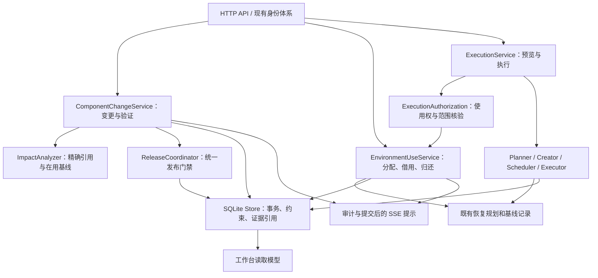
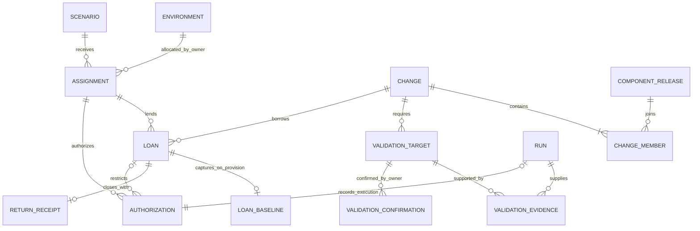
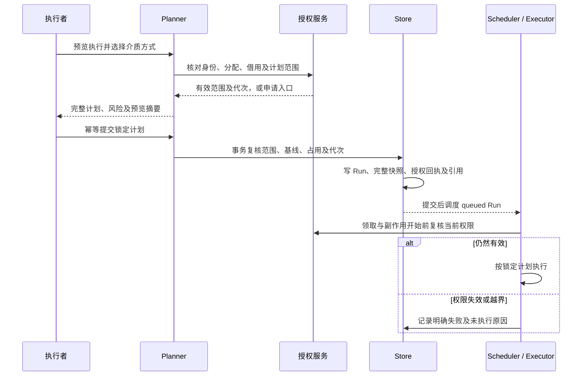
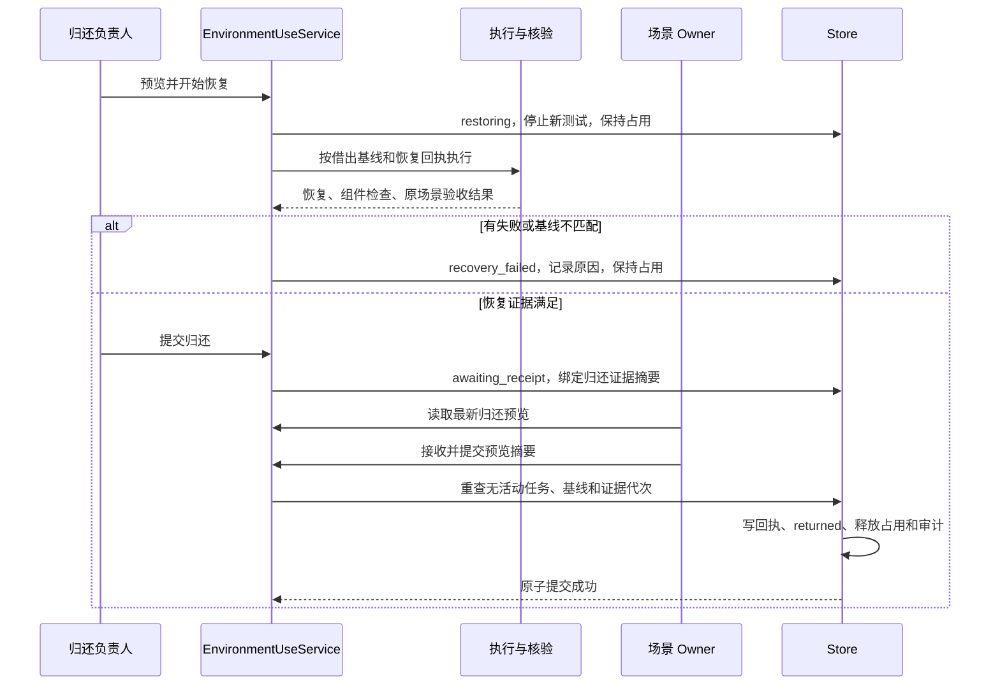
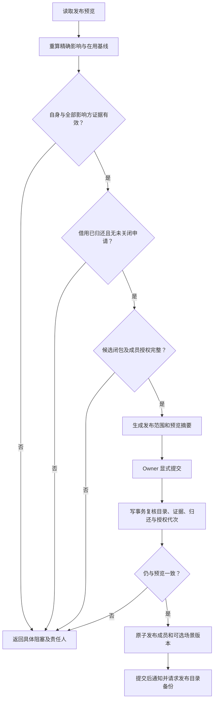

# Owner 协作方案三：后端领域、接口与一致性设计

> 状态：设计方案，尚未实施。本文中的新对象、接口、约束和迁移均为目标设计。
> 日期：2026-09-09。代码对照基线：`82434f8`。本次不修改运行时代码、现有 API、数据库或部署环境。
> 读者：后端、前端、测试及负责环境交付的工程师。

业务语义以[使用流程](workflow.md)为入口，页面与状态展示见[前端设计](frontend.md)。返回[文档中心](../../README.md)。

## 1. 设计边界和当前可复用能力

现有系统拥有精确 Release 依赖、候选联合发布、环境 Revision、安装基线、恢复回执、Run 快照、环境 FIFO 和发布并发保护。新增协作模型应使用这些事实，不以通知、前端按钮状态或通用工单替代。

| 当前代码入口 | 当前职责 | 目标调整 |
| --- | --- | --- |
| [release_review.go](../../../internal/service/release_review.go) | 组件合同人工审核 | 停止新审核写入，解除候选和发布的人工审核条件 |
| [components.go](../../../internal/service/components.go)、[logic.go](../../../internal/service/logic.go) | 发布／废弃影响和精确依赖遍历 | 扩展为可追溯的变更范围、在用历史覆盖及验证目标 |
| [release_coordinator.go](../../../internal/service/release_coordinator.go) | 组件和场景候选联合发布 | 接入统一变更门禁，校验全部影响方及借用归还 |
| [plan_builder.go](../../../internal/service/plan_builder.go)、[run_creator.go](../../../internal/service/run_creator.go) | 预览、计划锁定及创建 | 校验环境使用权，入队前完成介质决定和授权回执 |
| [approval_service.go](../../../internal/service/approval_service.go) | Run 批准／拒绝及取消 | 退役新执行审批；取消仍作为独立执行控制保留 |
| [lifecycle_recorder.go](../../../internal/service/lifecycle_recorder.go)、[scenario_execution.go](../../../internal/store/scenario_execution.go) | 安装及场景基线维护 | 加入借用前基线保护、受控恢复和归还复核 |
| [image_builds.go](../../../internal/service/image_builds.go)、[job_exports.go](../../../internal/service/job_exports.go) | 环境镜像构建和独立作业导出 | 覆盖授权及占用检查，关闭非 Run 执行旁路 |
| [schema.sql](../../../internal/store/schema.sql) | 关系、快照冻结及并发约束 | 新增协作事实表和原子约束，保留历史证据 |

继续采用 Go 模块化单体、SQLite 事务、既有执行编排和 SSE。新增领域职责不要求拆分进程、引入消息队列、工作流 DSL 或通用审批引擎。

### 1.1 必须始终成立的规则

| 编号 | 规则 |
| --- | --- |
| R1 | 组件候选和发布不再要求平台 Owner 人工审核；合同及真实质量证据仍必须有效 |
| R2 | 一个环境同时至多一个有效场景分配、一个已提供但未归还的借用；实际主机冲突同样受控 |
| R3 | 新的环境业务执行必须有有效分配或借用依据，申请中不能执行，范围外不能执行 |
| R4 | 借用整体独占，同一借用内仍按环境 FIFO；场景无关变更不能插入 |
| R5 | 范围内不创建新 Approval；缺失授权返回申请／调整入口，不降级到旧审批流程 |
| R6 | 验证结论必须由任务责任 Owner 在真实且匹配的证据上确认；第一版无人工豁免 |
| R7 | 借用必须恢复借出前基线，经场景接收后释放；超期、取消或恢复失败不能释放 |
| R8 | 发布前重查自身、全部影响方、全部借用、候选闭包及最新影响范围，整组成功或整组失败 |
| R9 | 版本变化只能使相关验证过期，不能改写历史成功 Run、已归还回执或既有发布版本 |
| R10 | 平台对可识别的执行范围负责，组件 Owner 对脚本业务副作用、兼容性和恢复能力负责 |

## 2. 模块与领域对象

`ImpactAnalyzer` 计算范围，不决定发布；`EnvironmentUseService` 管理使用事实，不解释 Ansible 业务；`ExecutionAuthorization` 统一判定有效权限；`ReleaseCoordinator` 对最终发布事务负责。避免在每个 HTTP handler 中复制门禁。

### 2.1 对象与最小存储内容

以下表名和字段为拟议逻辑模型，落地时统一新增精确 schema 合同；字段使用现有 camelCase API 风格。

| 对象／拟议关系表 | 主要内容 | 关键约束 |
| --- | --- | --- |
| `environment_assignments` | 环境、接收场景、分配人、状态、范围、是否可借、代次及时间 | 有效或请求收回的分配占有环境；无静默转交 |
| `environment_assignment_revisions` | 分配范围的不可变历史 | 每次范围修改新建代次，旧回执仍可追溯 |
| `environment_loans` | 变更、分配、场景、环境、申请人、归还负责人、状态、预计归还、借出基线引用 | 从提供到接收归还持续独占 |
| `environment_loan_revisions` | 参与成员、动作、凭据、交付范围和期限的不可变版本 | 待调整内容与当前生效版本分开保存 |
| `environment_loan_baselines` | 借出环境 Revision、安装清单、场景基线、备份及前置检查 | 提供时锁定，受归还和证据引用保护 |
| `environment_return_receipts` | 归还检查、恢复 Run、场景接收人、结论和时间 | 与释放占用同事务，写后不可改 |
| `component_changes` / `component_change_members` | 变更目的、负责人、成员 Draft、来源／目标、成员授权及阶段 | 一个 Draft 至多归属一个活动变更；只能 Owner 加入自己的组件 |
| `change_impact_revisions` / `change_validation_targets` | 影响范围版本、引用路径、验证源和目标、负责人、状态 | 任务按目标唯一，移出范围保留依据而非删除 |
| `change_validation_evidence` / `change_validation_confirmations` | 匹配的 Run、摘要、责任 Owner 结论及其绑定范围 | 无成功证据不可确认，确认绑定不可变目标摘要 |
| `execution_authorizations` | Run／构建／导出身份、操作者、分配或借用版本、执行范围及快照摘要 | 与工作创建同事务；之后不可变 |
| `environment_host_claims` | 活跃使用关系占有的实际主机集合 | 防止不同环境 ID 对相同主机重复独占 |

物理表可以按既有存储风格合并部分一对一内容，但不得把参与成员、关键引用或授权完整性仅藏在不可检索的自由 JSON 中。可变业务记录使用单调递增 `generation`；基线、授权回执及确认事件保留不可变版本。

每份授权都关联分配；组件借用授权同时关联借用。图中 Run 端可选，是因为构建或导出也要记录授权；存储应约束每份回执只能对应一个具体工作类型和 ID。

### 2.2 状态与终结

| 对象 | 状态／阶段 | 说明 |
| --- | --- | --- |
| 分配 | `active`、`recalling`、`closed` | 请求收回先停止新业务，活动借用完成前不能关闭 |
| 借用 | `requested`、`needs_info`、`in_use`、`restoring`、`recovery_failed`、`awaiting_receipt`、`returned`、`rejected`、`withdrawn` | 状态和中文标签一一对应前端文档 |
| 验证任务 | `pending`、`running`、`failed`、`awaiting_confirmation`、`confirmed`、`stale`、`out_of_scope` | 最后一项只由权威范围重算生成，保留移出原因，不是人工跳过 |
| 变更阶段 | `draft`、`validating`、`published`、`closing`、`closed` | “可发布”是有效证据及最新门禁派生状态，不单独保存一份 ready 真相 |

`overdue`、`recallRequested`、`pendingRevision` 作为使用限制／提示，不代替借用状态。变更关闭先进入 `closing`：撤回未使用申请，停止新测试，完成已发生使用的归还后才进入 `closed`。关闭变更不能免除恢复责任。

## 3. 变更影响与验证目标

### 3.1 计算输入

读取同一权威目录快照中的来源及目标 Release、直接执行依赖和配置依赖、活动 Draft／候选、每条版本线当前已发布版本、当前场景版本，以及环境实际安装和场景基线。

以精确来源 Release 为传播起点，沿反向依赖计算直接、间接消费者。配置映射同样影响验证，不能因为它不约束执行顺序而从影响分析中删除。

当前目录之外，只要某个旧 Release 或场景组合仍被安装，就补回该引用链；纯历史 Run、归档记录和无人使用的旧版本不单独生成发布任务。所有权查询使用内部完整视图，输出由资源权限裁剪。

新版本线且没有替换来源时，计算新组件自身及明确的协同引用，不虚构旧版本影响；如声明替换现有版本，必须提供明确来源并计算其消费者。兼容性声明只解释变更，不免除已确认要求的影响方验证。

### 3.2 任务生成与范围变化

任务包含 `sourceIdentity`、`targetIdentity`、责任 Owner、依赖路径、目标组件图、参数与环境适配条件、验收要求和 `targetDigest`。

| 目标 | 必须证明的内容 |
| --- | --- |
| 组件自身 | 当前合同下的新线安装／回滚证据，或演进版本的安装、升级、检查、回退闭环 |
| 下游组件 | 使用目标上游及参数映射后的组件合同、动作检查和需要的恢复证据 |
| 当前场景 | 候选替换后的完整组件检查及业务验收；有演进来源时覆盖相应升级路径 |
| 在用历史组合 | 该来源组合替换受影响版本后的对应验证；不能仅引用当前场景的普通成功 Run |

默认按来源版本组合及适配配置分别建任务。同一 Run 只有在组件摘要集合、参数、主机角色拓扑、环境适配条件和验收目标均匹配时，才能覆盖多个任务。不能仅依据 Scenario ID、组件名称或“都是 Kubernetes”判断等价。

变更成员内容改变时重新计算任务目标，对确实受该内容影响的证据和确认标记 `stale`；未变化且仍完整匹配的任务可保留。旧证据事件保留，不能修改成失败或清除历史。

提交发布时重新计算完整影响范围。新增目标会阻塞并要求补充验证；已无任何当前引用或在用安装的目标可由系统移出，但必须记录范围前后摘要和客观原因。调用者无删除任务或强制忽略能力。

### 3.3 专用验证副本和协同候选

验证目标保存不可变的来源与目标图。专用验证副本使用独立验证上下文，不切换 `Scenario.CurrentRevisionID`，不改写 Released Revision，也不伪造正式安装基线。

候选共享移除 `ReleaseReviewApproved` 条件，保留合同和自身证据门禁。验证共享候选时只要求自身及依赖候选的验证就绪，不能递归要求所有成员“可发布”，否则重新形成发布等待环。

需要适配的下游由其 Owner 创建并加入目标候选。对同一协同变更，所有成员的必需任务取并集，发布门禁以整个集合计算。成员加入授权针对自己的版本及整个集合摘要；成员或联合发布范围变化后，重新确认成员授权，不由一个 Owner 隐式发布另一个人的新版。

### 3.4 验证结论

先收集真实成功 Run 并验证其来源、目标、快照、执行范围、完整步骤和最终检查，再允许责任 Owner 提交非空验证结论。确认接口同时绑定任务代次、目标摘要和证据摘要。

平台核对证据完整性；Owner 确认业务结论。所有权不同的任务不能由变更发起人代办，且不能把“环境已提供”复用为验证确认。

已发布组件、历史 Run、已有归还回执在候选修改后仍不变；只使当前变更中相应证据引用失效。若需再次执行，已归还借用不能重新激活，应新建申请。

## 4. 环境使用与统一执行授权

### 4.1 分配和借出

环境 Owner 创建分配，限制 `scenarioId`、允许动作、主机范围、凭据引用、来源／目标介质命名空间及 `allowLending`。初始表单不默选整环境清理、任意凭据或任意交付地址，实际范围须在分配时明确提交。

借出前完成不持有长事务的主机连通性、配置、场景状态和备份能力预检，生成预览摘要。最终提供事务重读分配／环境代次、活动 Run／构建、主机占用和基线身份，确认仍匹配后写入基线、占用和 `in_use` 状态。

已有安装基线为 partial／unverified、恢复动作或备份不完整时拒绝提供。干净环境也要记录已有基础配置和检查结果，不能用空 JSON 表示“没有需要恢复的东西”。

同一实际主机通过 Inventory 别名、连接地址或环境复制出现时不能绕过独占。按平台解析并锁定的实际主机身份检查交集，别名共享地址仍冲突；端口或用户名变化不能视为不同主机。无法确定身份或范围漂移时拒绝借出，不猜测隔离成立。

### 4.2 有效权限

| 执行者和用途 | 必须具备的依据 |
| --- | --- |
| 场景正式执行 | 自己场景的有效分配，计划在范围内，环境未借出 |
| 组件测试、回滚、构建、介质交付 | 与当前变更关联的有效借用，自己是相应组件 Owner／授权参与者 |
| 借用中的场景验证 | 借用明确列出的场景责任人及验证目标；不可发起无关正式变更 |
| 恢复及归还验收 | 原借用的恢复范围；超期／收回后仍可用于恢复 |
| 环境 Owner 故障接管 | 显式记录接管人、原因及恢复范围，保留原借用责任链和占用 |

角色权限、资源所有权与环境使用权取交集。拥有环境不自动获得组件 Draft 编辑或发布权限；拥有组件不自动获得任意环境执行权限。

借用范围覆盖组件集合、动作集合、主机、凭据及交付边界，并锁定环境 Revision。单次 Run 再锁定完整当前版本内容；在原范围内修改 Draft 不需要重借，但必须重新生成计划并使受影响证据过期。

扩权先形成待生效范围版本，场景受理前原授权继续有效；上层分配不足则先由环境 Owner 调整分配。缩权、到期和收回使新业务停止，排队工作在领取时重新校验。正在运行的任务不因状态变化被无条件强杀；显式取消和恢复继续沿用受控执行规则。

### 4.3 授权和入队时序

不新增 `awaiting_approval` 工作；权限缺失在提交前返回业务阻塞，已排队工作失效则收敛为有明确原因的终态，不能滞留为无人处理的等待记录。

旧 `NeedsApproval` 和历史 `Destructive` 曾包含审批语义，不能直接当作新权限的全部依据。新的判断将风险与授权分离：组件动作及场景验收的 `high`／`destructive` 统一进入风险展示和授权范围校验；名称中的清理／恢复标记可保守提示，但不能授予或扩大权限。

### 4.4 介质、续跑和非 Run 入口

介质来源或目标没有匹配内容时，仍需明确选择 `direct` 或 `transfer`；选择必须在分配／借用的范围内。目标已存在可复用内容时不凭空创建一次人工申请。来源及目标可访问性、内容身份和校验和仍按既有交付逻辑验证。

介质决定在 Run 创建前完成，随计划和授权回执一起冻结。新 Run 自创建起不再允许以审批为由修改快照，交付观察仍独立写入结果。

续跑创建新的授权回执，核对当前有效借用、原计划身份、剩余步骤及恢复状态；不能继承历史批准结果绕过现在的权限。已归还借用不能支持旧 Run 的后续执行。

镜像构建、真实环境执行准备、介质上传／平移和独立作业导出都纳入同一授权入口；配置登记或只读目录查询不因本方案变成借用动作。只有确实使用目标环境资源的操作占用其使用关系。

独立作业导出本身不证明执行成功。导出时核对使用权并记录环境、范围和快照；作业离开平台后，平台不能仅靠自身状态阻止外部运行。第一版不把手工声明或不受控离线执行作为验证、归还成功证据，需通过受治理的执行和基线复核取得证据。

## 5. 恢复基线与接收归还

### 5.1 基线包含什么

借出基线包含环境 Revision、实际主机身份、非敏感参数／变量、组件安装来源及节点身份、场景正式或测试基线、备份引用、恢复计划和借出前检查证据。

**记录基线不等于已经备份业务数据。** 需要恢复的数据必须具备可用备份或明确的可逆动作，检查其来源、可读性及恢复能力后才允许提供环境。组件 YAML 负责声明并执行业务恢复和残留检查，平台不重新引入一套文件级资源合同来猜测脚本的全部影响。

第一次可能改变借出基线的动作开始前，持久化“借用正在改变环境”的事实，使原场景不能继续被当作未变化的可执行正式基线。原基线完整保存在借出记录中，实际安装状态继续按真实步骤维护，不能只在内存里冻结旧清单。

恢复规划使用原借出基线、已执行动作回执和备份链，按实际修改的逆序还原。已有升级历史时不能调用“清理至空环境”冒充恢复。没有可靠恢复路径则保持 `recovery_failed`，不得通过回写数据库安装记录假装恢复完成。

### 5.2 从恢复到释放的事务

远端恢复和检查在事务外执行；数据库事务只锁定和复核其证据及当前代次，不能持有 SQLite 写事务等待 SSH／Ansible。

接受归还必须同时满足：

1. 借用为 `awaiting_receipt`，调用者仍是接收场景的 Owner。
2. 没有 queued／running 的相关 Run、活动构建或未结束的恢复工作。
3. 当前环境配置和实际安装身份匹配借出目标；恢复及必要的原场景验收全部通过。
4. 归还预览之后没有新的可变动作、安装代次或证据变化。
5. 收回、接管及恢复关系中的引用完整，所有关键备份和证据仍受保护。

恢复后的正式基线要通过既有基线记录职责重建有效证据链，关联原来源和此次恢复证明；不能直接复制历史 `ready` 状态。任何一项失败都保留占用，不写成功回执。

### 5.3 失败、超期和接管

- 超期或上层请求收回时阻止新测试，取消尚未开始且不再授权的业务工作；恢复动作仍可按原范围继续。
- 场景退回归还进入 `recovery_failed`，保留原因；修复后重新恢复、预览并提交。
- 环境 Owner 接管记录独立责任事件，只获得明确恢复用途的执行权，不自动确认验证或接受场景归还。
- 服务重启以持久化借用、Run、构建和恢复状态重新收敛。中断工作继续保留恢复义务，不能按超时清除占用。
- 长期无法恢复时保持异常占用和发布阻塞；第一版不设置“强制成功归还”或“发布豁免”按钮。

## 6. 发布事务与目录一致性

单组件发布、组件协同发布和既有场景候选联合发布都调用同一组变更门禁。组件 Owner 发布自己的版本；联合提交者必须拥有对应场景或是集合负责人，且每个组件成员都有有效的联合发布授权。

复用现有发布目录写锁和 guard，但范围扩展到变更成员、必需任务、证据确认、借用归还和环境安装代次。安装生命周期写入也必须进入统一的发布范围并发控制：可通过同一写事务内重读当前安装集合验证，而不是把网络检查置于发布事务内。

预览成功不锁住外部世界；最终事务重算／核对出现新引用、新安装、Owner 变化、候选撤回或证据失效时整批失败。不能只核对前端传回的任务列表。

已拒绝和未使用即撤回的申请不算未归还；处于 `requested`／`needs_info` 的申请需先撤回或完成借还。发布前必须关闭待生效范围调整，防止版本发布后又在同一变更下开始新测试。

若某成员依赖其他未发布成员，整个依赖闭包同事务发布。没有未发布依赖的单组件可以独立发布，但仍要完成它所属活动变更的全部必需任务和归还。

通知、SSE 和发布目录备份在提交后触发；它们不替代持久化状态，也不能把未提交的发布显示成功。发布只改变目录状态，不创建正式环境升级 Run。

## 7. 拟议 API 与公共接口

以下均是**拟新增或拟调整接口**，不是当前已注册路由。路径省略 `/api/v1` 前缀；既有正式接口说明仍以[当前后端设计](../../backend-design.md)为准。

### 7.1 分配与借用

| 方法 | 拟议路径 | 用途与操作者 |
| --- | --- | --- |
| GET | `/environment-assignments`、`/environment-assignments/{id}` | 分页读取可见分配，按场景／环境过滤 |
| POST | `/environment-assignments/plan` | 环境 Owner 预览新分配或范围调整 |
| POST | `/environment-assignments` | 创建分配，绑定预览及幂等键 |
| POST | `/environment-assignments/{id}/revisions` | 环境 Owner 提交新范围版本 |
| POST | `/environment-assignments/{id}/recall` | 环境 Owner 请求收回，立即限制新业务 |
| POST | `/environment-assignments/{id}/close` | 无活动借用和工作后显式结束分配，不清理业务主机 |
| GET | `/environment-loans`、`/environment-loans/{id}` | 读取申请、当前有效范围、基线和状态 |
| POST | `/environment-loans/plan` | 预览申请，可见性／范围／恢复能力检查 |
| POST | `/environment-loans` | 组件 Owner 提交申请 |
| POST | `/environment-loans/{id}/resubmit` | 申请人补充后重新提交 |
| POST | `/environment-loans/{id}/provision-plan`、`/environment-loans/{id}/provision` | 场景 Owner 预览并提供环境 |
| POST | `/environment-loans/{id}/request-changes`、`/environment-loans/{id}/reject` | 场景退回补充／拒绝，原因必填 |
| POST | `/environment-loans/{id}/withdraw` | 申请人撤回尚未发生使用的申请 |
| POST | `/environment-loans/{id}/revisions` | 申请人提出范围或预计归还时间调整 |
| POST | `/environment-loans/{id}/revisions/{revisionId}/apply`、`/environment-loans/{id}/revisions/{revisionId}/discard` | 场景受理生效，或申请人／场景撤销待生效调整 |
| POST | `/environment-loans/{id}/request-return` | 场景请求归还，停止新测试 |
| POST | `/environment-loans/{id}/restoration-plan`、`/environment-loans/{id}/restoration-runs` | 归还负责人预览及执行恢复 |
| POST | `/environment-loans/{id}/return-submission` | 归还负责人绑定完整恢复证据，进入待接收 |
| GET | `/environment-loans/{id}/return-preview` | 场景 Owner 读取最新接收预览 |
| POST | `/environment-loans/{id}/return-receipt`、`/environment-loans/{id}/return-rejection` | 场景接收／退回，均记录结论 |
| POST | `/environment-loans/{id}/takeover` | 目标环境 Owner 显式接管恢复，记录原因及范围 |

### 7.2 变更与验证

| 方法 | 拟议路径 | 用途与操作者 |
| --- | --- | --- |
| POST | `/component-changes/plan`、`/component-changes` | 组件 Owner 预览并创建变更 |
| GET | `/component-changes`、`/component-changes/{id}` | 按当前用户职责读取变更及派生发布状态 |
| POST | `/component-changes/{id}/members` | 对应组件 Owner 加入成员并确认联合范围 |
| POST | `/component-changes/{id}/members/{releaseId}/withdraw` | 对应 Owner 撤回成员，重新计算任务，保留归还责任 |
| POST | `/component-changes/{id}/members/{releaseId}/publication-consent` | 成员 Owner 对当前集合摘要确认联合发布授权 |
| GET | `/component-changes/{id}/impact`、`/component-changes/{id}/validation-targets` | 读取影响路径、目标和证据完成情况 |
| POST | `/component-changes/{id}/validation-targets/{targetId}/execution-plan`、`/component-changes/{id}/validation-targets/{targetId}/runs` | 在有效使用关系下运行专用验证目标 |
| POST | `/component-changes/{id}/validation-targets/{targetId}/evidence` | 关联已存在 Run，服务端重新判定能否计入 |
| POST | `/component-changes/{id}/validation-targets/{targetId}/confirmation` | 任务责任 Owner 提交基于真实证据的结论 |
| GET | `/component-changes/{id}/publication-plan` | 重算发布范围及阻塞，不执行发布 |
| POST | `/component-changes/{id}/publish` | 有权提交者绑定最终预览进行原子发布 |
| POST | `/component-changes/{id}/close` | 停止变更，先归还再关闭，不能跳过责任 |

### 7.3 公共请求和响应

关键写操作沿用 `expectedPlanDigest`、`expectedGeneration` 及幂等提交机制；同键同请求重试返回已有结果，同键不同内容返回冲突。预览 DTO 至少提供 `planDigest`、`blockers`、当前对象代次、拟作用范围及可读摘要。

执行请求增加 `authorizationContext`，包含 `assignmentId`、可选 `loanId` 和可选 `validationTargetId`；真实版本、操作者及范围由服务端读取并决定，不能信任客户端自报授权。组件执行必须提供借用；场景自用提供分配。授权上下文及最终内容一起参与计划摘要。

新的执行预览返回 `authorization.status`（`allowed`／`application_required`／`scope_change_required`／`blocked`）、使用依据及原因。新 UI 不再依赖 `requiresApproval` 判断操作；历史风险字段保留只读解释，不能通过删除风险信息来迁移。

错误响应沿用可操作错误风格，包含稳定 `code`、中文说明和具体对象入口。例如：

| code | 用户含义 |
| --- | --- |
| `environment.assignment_required` | 需要先将环境分配给场景 |
| `environment.loan_required` | 组件需要向场景申请使用 |
| `environment.scope_exceeded` | 计划超过当前有效范围 |
| `environment.occupied` | 环境或实际主机已被其他关系占用 |
| `environment.recovery_incomplete` | 原基线尚未恢复，不能提交或接收归还 |
| `validation.evidence_stale` | 证据对应内容或目标已变化 |
| `change.validation_incomplete` | 自身或影响方验证未完成 |
| `change.environment_not_returned` | 仍有未结束使用或待关闭申请 |
| `change.impact_changed` | 发布范围在预览后变化，需要重新核对 |

权限不足使用 403，状态或摘要冲突使用 409，输入无效使用 400。查询只返回调用者可见内容；不存在或无权查看的私有对象不借错误响应泄露其合同与凭据。

## 8. 审计、引用保护与迁移

### 8.1 审计和读取

分配、提供、范围调整、超期限制、请求收回、接管、归还提交／退回／接收、验证确认／失效和发布分别保存事实事件。每个事件关联对象、操作者、前后代次、原因及证据引用。

关键业务状态与审计同事务写入，提交后发 SSE。工作台按现有授权范围派生待办；通知可以提醒但不能作为任务是否完成的依据。

借出基线和验证证据引用的环境 Revision、Release、Scenario Revision、Run、回执和备份都纳入删除／归档／清理保护。成功归档可以改变存储位置，但不能让受保护证据变得不可读；失败记录清理不能删除未归还环境所需的恢复链。

### 8.2 新旧流程切换

本方案是当前平台协作模型调整，不代表已授权停服、迁移或清空数据库。迁移目标是保留已有业务数据和历史证据，并在新运行时仅接受一个当前 schema 合同。

1. 后续实现提供针对明确来源合同的离线转换与验证，不在普通启动时自动升级，也不建立通用双写／双读兼容层。
2. 切换前清空 queued／running／awaiting_approval Run、活动构建及会产生执行副作用的后台准备工作。旧待审批必须由原有流程显式完成或结束，不能自动批准或删除。
3. 保留旧 Release 审核、Approval、Run、日志、作业包和安装来源。对新运行流程停用旧审核与审批写接口，返回已退役说明；历史记录继续只读。
4. 已发布版本不重新变成 Draft；未发布版本使用新门禁。旧成功 Run 只在内容和目标确实匹配时可作为证据，不能补造新的影响方确认或借用归还。
5. 现有环境初始显示待分配。不能从历史使用者推断有效分配、借用或参与权限。
6. 保留原执行快照字节，新增授权回执通过 Run ID 与快照摘要关联。历史工作标识为旧流程只读；旧 Run 若续跑，需要新的有效授权上下文和回执。
7. 更新冻结约束：新 Run 在创建前完成交付决定，创建后执行快照不可变；旧审批记录不再赋予修改新 Run 快照的能力。
8. 使用源／目标独立副本、备份、逐表数量及摘要、外键和引用校验完成迁移演练。新服务开始写入后不能自动恢复旧数据库覆盖新事实。

当前[首版策略](../../version-policy.md)和[Run 快照合同](../run-snapshot-contract.md)描述已实现流程；本专项方案不会在仅编写文档时把它们改写成已实施的新能力。正式实现时同步更新当前合同说明、部署门禁和备份工具。

## 9. 实施批次与验收

| 批次 | 实现内容 | 完成标准 |
| --- | --- | --- |
| A | 影响分析、变更成员、验证目标和统一发布门禁 | 精确范围可复算，证据与确认可靠绑定，协同候选无循环等待 |
| B | 环境分配、借用、基线、恢复和接收 | 独占及接收原子化；失败、超期、关闭均保留恢复责任 |
| C | 统一执行授权、非 Run 入口、介质决定前移 | 有效范围内无需逐 Run 审批，越权和旁路全部拒绝 |
| D | 三类资产页面、工作台、旧审批退役 | 完整用户流程可操作，历史记录只读可追溯 |
| E | 数据转换、部署门禁与端到端演练 | 保留数据、严格切换、验证新流程；单独报告真实环境结果 |

各批次可以分别提交可审查改动，但只有整套流程通过验收后统一启用，不能先删除审批门禁再补使用权控制。

### 9.1 回归矩阵

| 编号 | 核心测试 | 必须满足 |
| --- | --- | --- |
| T1 | 精确版本线、直接／间接／配置依赖、活动 Draft | 影响范围完整，其他版本线不误报 |
| T2 | 当前场景、仍安装的历史组合、纯历史 Run | 前两类纳入任务，纯历史只追溯 |
| T3 | 候选内容变化、任务目标变化、Owner 变化 | 相关确认失效，历史证据不改写 |
| T4 | 多组件、多场景候选协作 | 自身就绪即可共享；任一必需任务未完成则所有发布入口阻塞 |
| T5 | 发布与新引用、新安装、成员撤回同时发生 | 原子重查，不遗漏范围，不发生部分发布 |
| T6 | 两份申请并发提供、复制环境或主机别名 | 只有一份成功占有实际环境范围 |
| T7 | 错误角色、资源 Owner、未分配、申请中、超范围 | 提交失败，无授权 Run 或构建不进入执行 |
| T8 | 领取前到期、收回、范围缩小、服务重启 | 不执行越界计划，不生成新审批等待或错误释放 |
| T9 | 普通及高风险动作、介质选择、续跑 | 有效授权下直接排队，风险信息和完整快照仍保留 |
| T10 | 镜像构建、真实环境准备、介质交付、作业导出 | 不绕过使用关系，不把导出成功当作验证成功 |
| T11 | 空环境恢复、已有场景恢复、升级历史恢复 | 恢复借出前基线；不能以清空或写旧数据库行代替 |
| T12 | 恢复失败、接收前状态漂移、重复接收、强制关闭尝试 | 保持占用或拒绝过期操作；回执与释放原子提交 |
| T13 | 待归还记录的删除、归档和清理竞争 | 所需证据、备份与来源链完整受保护 |
| T14 | 迁移旧审核、Run、作业包、证据及未分配环境 | 不改写历史、不补造授权，未知合同失败关闭 |
| T15 | 四角色桌面流程及深链、权限切换、SSE | 与前端状态表一致，表单不丢失，无旧审批可写入口 |

测试使用真实临时数据库验证事务和并发，用受控依赖替身覆盖外部失败。Ansible 本地验收使用 `clusterforge-test-ubuntu:18.04-ansible2.8.8` 和 `/opt/ansible/bin/ansible-playbook`，不以 macOS Ansible 替代。

实现后的验证分别记录 Go／前端测试、固定容器执行、迁移演练、桌面视觉验收、部署和真实环境借还结果。文档编写阶段仅执行文档检查与图表检查，不把这些检查记作新业务功能已经通过测试。
