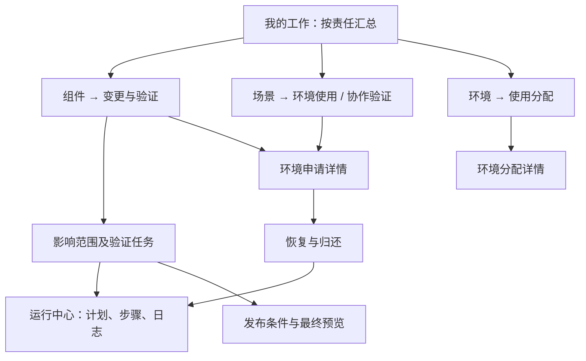
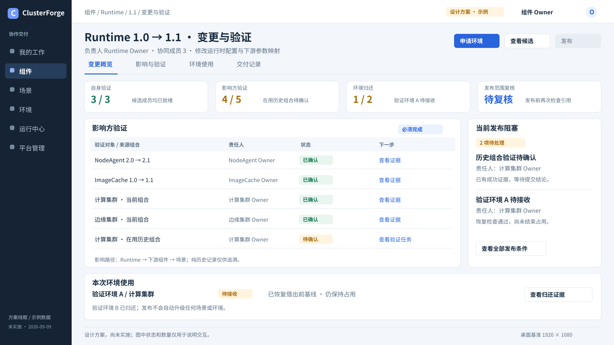
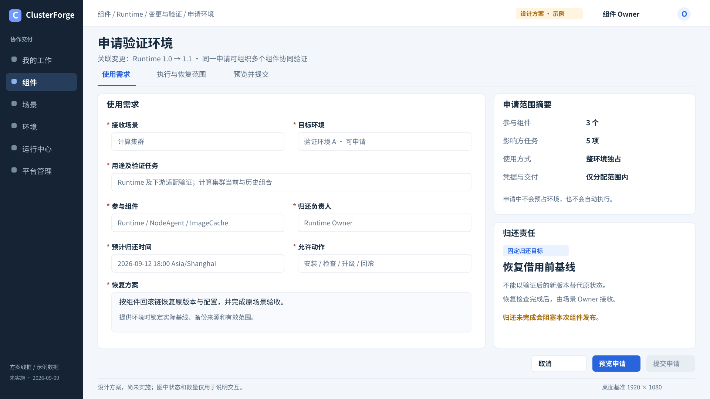
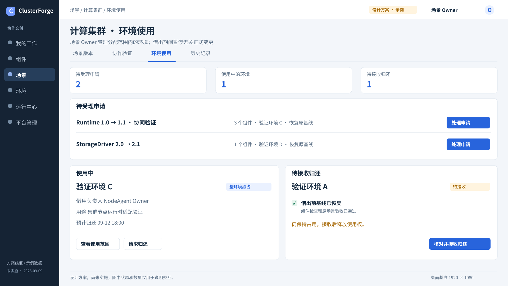
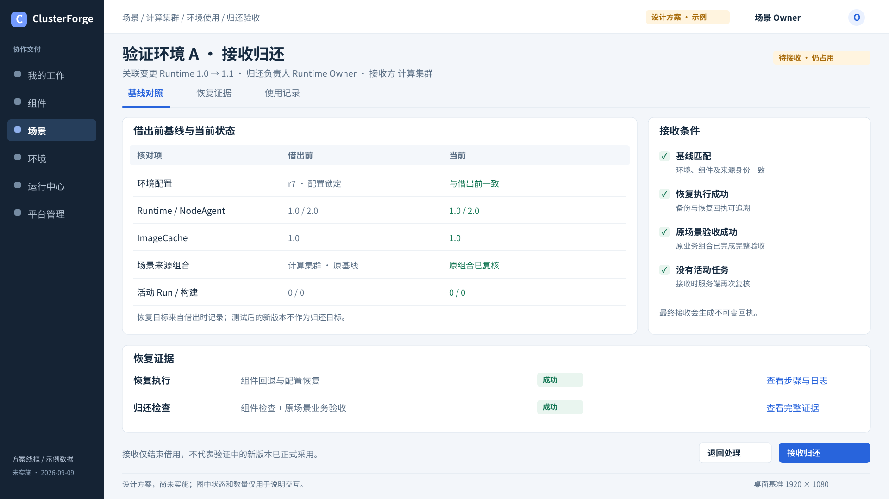
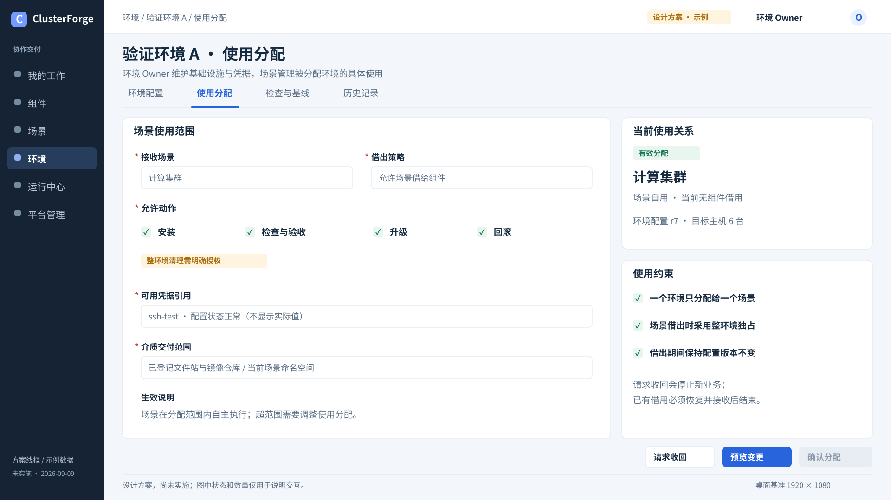
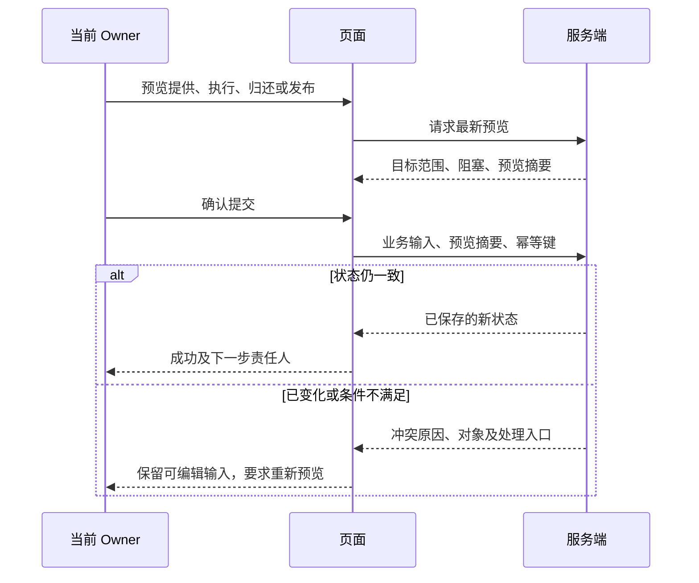

# Owner 协作方案二：前端与交互设计

> 状态：设计方案，尚未实施。页面线框、按钮、状态和接口联动均为拟议设计。
> 日期：2026-09-09。代码对照基线：`82434f8`；桌面验收基准：1920×1080。
> 本文配图中的组件、场景、版本和完成数量都是示例，不是当前平台运行结果。

先读[使用流程](workflow.md)，接口和事务约束见[后端设计](backend.md)。返回[文档中心](../../README.md)。

## 1. 界面要让用户随时知道什么

每个工作页面都要回答四件事：**我负责什么、谁在等我、目前卡在哪里、下一步做什么**。

借用申请、验证结论和归还接收分别呈现。页面不再用一个“审批通过”按钮混合表达三件事，不在组件发布入口要求平台 Owner 审核。

保留当前组件、场景、环境、运行中心和工作台导航。第一版不新增独立的“审批中心”或通用工单平台，也不把环境申请藏进 Run 详情。

### 1.1 入口和深链

沿用既有路由，增加可复制的查询参数。以下为拟新增深链，切换标签或对象应写入 URL，支持刷新和浏览器前进／后退。

| 工作入口 | 拟议深链形式 | 主要用户 |
| --- | --- | --- |
| 组件变更 | `/components?selected={componentId}&release={releaseId}&tab=change&change={changeId}` | 组件 Owner及有权参与者 |
| 借用申请 | `/scenarios?selected={scenarioId}&tab=environment-use&loan={loanId}` | 场景 Owner、申请参与者 |
| 影响方验证 | `/scenarios?selected={scenarioId}&tab=validation&change={changeId}&task={taskId}` | 场景 Owner |
| 环境分配 | `/environments?selected={environmentId}&tab=assignment&assignment={assignmentId}` | 环境 Owner、场景 Owner |
| 归还接收 | 借用深链增加 `view=return` | 归还负责人、场景 Owner |
| 具体执行 | `/runs?selected={runId}` | 拥有该 Run 可见权限的用户 |

没有访问权限、对象已经关闭和对象确实不存在分别显示说明。不能为了让深链可用而向参与者开放其他人的完整组件或场景编辑权限。

## 2. 组件：变更总览与验证任务

*图 F1：变更详情的目标布局。示例中影响方已确认 4/5，仍有一个环境待接收，所以“发布”保持不可用。*

### 2.1 页面结构

- 页头固定显示组件、来源／目标版本、变更负责人和整体状态；发布、候选共享放在同一动作区。
- 一级标签为“变更概览、影响与验证、环境使用、交付记录”；组件参数和 Playbook 编辑仍保留既有入口。
- 概览摘要展示自身验证、影响方验证、环境归还和范围复核四组条件；不合成为容易掩盖问题的单一百分比。
- 影响任务表是主体，按组件和场景分组；显示责任 Owner、来源组合、目标组合、影响原因、状态、证据及下一步。
- 右侧摘要区显示当前阻塞和责任人。点击阻塞应定位具体任务、申请或恢复检查，不只弹出错误文本。

### 2.2 影响范围展示

默认展示当前有效引用和在用历史组合，提供“包含纯历史引用”开关。切换只改变展示，不改变后端计算的发布范围。

| 展示字段 | 说明 |
| --- | --- |
| 影响对象 | 组件＋精确版本，或场景＋来源版本组合 |
| 影响原因 | 直接依赖、间接依赖、参数映射、在用历史组合，可并列 |
| 依赖路径 | 例如 Runtime → NodeAgent → 计算集群，支持展开 |
| 责任 Owner | 负责适配和提交该任务结论的人 |
| 验证目标 | 明确替换后的候选集合、目标参数及验收范围 |
| 执行证据 | 匹配的 Run 和检查结果；历史旧证据展示过期原因 |
| 发布影响 | 必须完成／仅追溯；用户没有“忽略阻塞”勾选框 |

依赖图辅助解释传播，表格承载逐项办理。不能强迫用户只靠大型关系图找负责人。

### 2.3 候选与发布操作

| 按钮 | 可用条件 | 点击后的结果 |
| --- | --- | --- |
| 建立变更 | 当前用户拥有目标 Draft；尚无活动变更 | 预览修改范围，填写目的后创建 |
| 共享候选 | 自身合同与自身验证就绪 | 允许影响方使用该候选验证；不直接发布 |
| 加入协同集合 | 当前用户拥有成员 Draft，集合仍可编辑 | 显示联合发布边界并记录成员授权 |
| 申请环境 | 变更未关闭，具有申请权限 | 打开带入当前变更的申请表单 |
| 确认验证结论 | 当前用户是任务责任 Owner，匹配证据完整有效 | 核对目标和证据，填写结论后确认 |
| 重新验证 | 任务失败或证据过期，具有有效环境使用权 | 转到执行准备与预览 |
| 发布／联合发布 | 所有自身、影响方、归还及范围条件满足 | 打开最终范围预览，显式提交后原子发布 |

发布不可用时，旁边保留可点击的“查看阻塞原因”。失效证据不能仅用灰色按钮表示，要给出具体变化，如“Runtime 1.1 的 Playbook 已更新，计算集群任务需要重验”。

## 3. 组件：申请环境与使用期间操作

*图 F2：申请表单。右侧始终显示变更影响和归还责任，必填项使用红色星号。*

### 3.1 申请表单

表单优先使用现有 Ant Design 控件。选择场景后再选择其允许借出的环境，选项同时显示占用状态、适配条件和环境版本。

| 字段 | 必填 | 输入与提示 |
| --- | --- | --- |
| 关联变更 | 是 | 从组件入口自动带入，展示来源／目标及成员 |
| 接收场景 | 是 | 选择愿意提供环境的场景；不要求已有组件引用 |
| 目标环境 | 是 | 当前场景分配范围内的环境；忙碌环境可申请，但不能立即提供 |
| 用途及验证任务 | 是 | 勾选真实任务并说明此次借用要完成的工作 |
| 参与组件、Owner | 是 | 只允许变更成员及其责任人；不能任意选择他人账号取得写权限 |
| 归还负责人 | 是 | 从申请参与的组件 Owner 中选择一人 |
| 允许动作 | 是 | 明确列出安装、检查、升级、回滚等；危险动作保留可见标记 |
| 凭据与介质范围 | 按计划 | 展示可用引用名称及来源／目标；不返回 Secret 实际值 |
| 预计归还时间 | 是 | 本地时间输入，同时明确时区；没有自动延长 |
| 归还目标 | 固定 | 恢复借用前基线；不提供“保留新版本”选项 |
| 恢复方案 | 是 | 选择已声明的恢复能力；具体基线在提供环境时锁定 |

“预览申请”展示服务端校验结果；通过后“提交申请”。提供成功前不创建执行 Run，也不默认占用环境。

### 3.2 申请详情与使用条

申请详情共用一份数据视图，动作随角色变化：申请人可补充、撤回未使用申请和发起范围调整；场景 Owner 可提供、退回或拒绝。提供过程中仍显示旧状态，服务端确认成功后才显示“使用中”。

使用中的环境条显示：

> 计算集群 / 验证环境 A · 整环境独占 · 负责人 Runtime Owner · 预计归还 09-12 18:00 · 范围已生效

操作区提供“准备执行、查看范围、申请调整、恢复与归还”。普通测试、回滚、续跑沿用现有计划预览，不增加审批弹窗。

范围调整展示新增和移除的组件、动作、凭据、介质目标及时间。待调整范围生效前，原范围保持有效；超期或请求收回时只能继续恢复及归还。

## 4. 场景：受理、协作验证与环境占用

*图 F3：场景 Owner 的工作页面。环境状态与申请状态分别展示，避免把“申请中”误认为已经借出。*

### 4.1 列表与详情

“环境使用”分为三组：**待受理申请、使用中的环境、待接收归还**。提供“全部记录”查看已拒绝、已撤回和已归还历史。

点击“处理申请”打开右侧详情抽屉，展示变更摘要、参与者、验证范围、恢复能力和环境预检。页脚为“退回补充、拒绝提供、提供环境”，不用“批准执行”。

提供条件不满足时展示原因和负责方：

- 环境尚未分配／范围不足：联系环境 Owner 调整分配。
- 环境被占用／存在活动构建：等待占用结束，不能强制覆盖。
- 基线不可信／恢复能力不足：先完成检查或恢复方案，不能借出后补录。

“协作验证”列表显示当前场景承担的任务。任务详情按“来源组合、目标组合、执行证据、验证结论”组织；在用历史组合显示醒目的来源标记，避免编辑正式当前版本。

### 4.2 当前使用与正式操作

场景自己使用已分配环境时显示“场景自用”；只有在分配范围内且环境没有被借出时，正式安装、升级、回滚等入口才可用。

借出期间正常展示操作入口及原因，但不可提交无关 Run。被该借用明确授权的场景验证、恢复核验通过申请详情进入，防止绕过占用边界。

## 5. 恢复与归还：按证据接收

*图 F4：待接收归还。示例恢复证据齐全，场景 Owner 仍需核对后接收，环境才结束占用。*

页面采用上下文页而非小型确认框，依次显示：

1. **借用摘要**：谁借用、关联变更、借出与预计归还时间、当前状态。
2. **借出前与当前对照**：环境版本、组件组合、参数配置、安装来源与备份状态。
3. **恢复证据**：恢复执行、组件检查、原场景验收、活动任务数量及剩余问题。
4. **归还动作**：归还负责人提交；场景 Owner 接收或退回处理。

| 当前状态 | 归还负责人动作 | 场景 Owner 动作 | 系统限制 |
| --- | --- | --- | --- |
| 使用中 | 预览并开始恢复 | 查看使用、请求归还 | 同一借用内仍可提交原范围测试 |
| 恢复中 | 查看步骤、按安全续跑规则继续 | 查看恢复进度 | 停止新测试，不释放占用 |
| 恢复异常 | 处理失败、重新预览恢复 | 协调故障接管 | 所有阻塞明确展示，不能提交“强制归还” |
| 待接收 | 查看证据和等待接收 | 接收归还、退回处理 | 不再接受新的变更执行 |
| 已归还 | 查看回执、新建后续申请 | 查看历史 | 原申请不能重新开启执行 |

“提交归还”和“接收归还”分开。两次操作都重新校验后端状态，前端不根据本地勾选框推断基线已经恢复。

恢复对照优先展示用户能够理解的版本、主机组和检查项。摘要、Run ID、备份引用等放进可展开证据区，不能要求普通用户手工输入摘要才能完成归还。

## 6. 环境：分配范围和占用信息

*图 F5：环境 Owner 设置场景使用范围。此处的权限针对后续使用关系，不是针对某个 Run 的批准。*

在环境详情增加“使用分配”标签，显示接收场景、允许动作、借出策略、凭据引用、介质范围和当前占用。

- 创建或调整分配采用“预览变更 → 确认分配”，明确对场景已有使用的影响。
- 同一环境不能同时分配给两个场景。检测到共享实际主机时说明冲突环境，不仅检查环境名称。
- 借出期间冻结环境配置版本；需要更改时先结束借用或进入显式故障接管。
- “请求收回”使新增测试或正式变更停止，不等于立即释放。接管必须显示接管人、原因及仍需完成的恢复责任。
- 凭据只显示名称、用途和配置状态；Secret 不出现在表单、图示或审计备注中。

## 7. 工作台、运行中心和旧入口调整

### 7.1 我的工作

| 角色 | 新增待办理项 | 主操作 |
| --- | --- | --- |
| 组件 Owner | 待补充申请、失败／过期验证、待确认任务、待恢复环境、可发布变更 | 补充申请／处理验证／恢复与归还／查看发布条件 |
| 场景 Owner | 待受理借用、协作验证、待接收归还、超期环境 | 处理申请／确认验证结论／接收归还 |
| 环境 Owner | 待分配环境、分配范围不足、收回与故障接管 | 分配使用权／查看使用责任 |
| 平台 Owner | 保留目录治理及历史管理事项 | 不再出现组件合同审核任务 |

同一项事实只生成一条对应职责的待办。通知说明“某对象发生了变化”，工作台显示当前实际状态；已关闭事项不能因为旧通知还未读而继续作为待办理项。

### 7.2 运行中心

新 Run 详情增加“使用依据”：场景分配或组件借用、范围版本、发起人、关联变更及验证任务。保留风险说明和执行计划，不显示新 Run 的批准／拒绝按钮。

当权限不足时，执行预览说明“需要申请环境”或“需要调整范围”，并给出对应入口。已经排队但权限发生变化时，显示明确失败原因，不转成新的人工审批任务。

历史 Run 的审批决定和历史组件合同审核作为只读记录呈现，带“历史流程”标记。旧深链落到历史说明或新的操作入口，不能点击旧按钮对新流程生效。

## 8. 状态、错误与并发交互

### 8.1 状态词表

三份文档共用以下用户词汇，接口枚举见后端文档。

| 对象 | 用户状态 |
| --- | --- |
| 环境分配 | 有效、请求收回、已结束 |
| 借用申请 | 申请中、待补充、使用中、恢复中、恢复异常、待接收、已归还、已拒绝、已撤回 |
| 验证任务 | 待验证、验证中、验证失败、待确认、已确认、需重验；历史范围移出项单列追溯 |
| 变更 | 草稿、验证中、可发布、已发布、关闭中、已关闭 |

“超期”“范围待调整”“证据已过期”使用带文字的提示，不只依赖颜色。危险操作保留风险标识，但不命名为“待审批”。

### 8.2 服务端复核及前端保存

- 多人操作冲突不能自动重发有副作用请求；先读权威状态，再决定是否重新预览。
- SSE 只触发有关对象的读取，不清空未保存表单、不刷新整个工作台所有列表。
- 身份切换后清理旧角色可见缓存；不可把“刚才看到的可用按钮”当作权限依据。
- 表单明确“未保存／已保存”；关闭有改动的表单时提示丢弃风险。
- 列表加载失败保留已加载上下文并给重试；拒绝请求不伪装成空列表。

## 9. 桌面布局与可访问性验收

- 1920×1080 下保留约 224 px 左导航、72 px 顶栏；内容区按 24–32 px 间距组织，主要信息在首屏可扫描。
- 宽表格优先压缩非关键列并提供展开详情；溢出在表格容器内横向滚动，不带动整页。
- 关键动作固定于页面或抽屉页脚；不能覆盖最后一行、错误提示或证据链接。
- 必填项使用红色 `*` 和可访问名称；风险、过期、失败同时提供文字。
- 主按钮分别使用“提供环境”“确认验证结论”“提交归还”“接收归还”“发布”，不使用意义不明的统一“通过”。
- 按 Tab 能访问筛选、证据、详情和动作；弹窗关闭后焦点回到原触发位置。
- 全部线框是页面布局意图，实际实现沿用现有 React／TypeScript／Ant Design 组件系统，不引入第二套 UI 框架。

## 10. 前端验收场景

| 场景 | 可观察结果 |
| --- | --- |
| 组件 Owner 新建申请，场景退回后补充 | 输入保留、责任人明确、申请未占用环境 |
| 场景提供环境 | 预检通过才进入使用中；其他等待申请显示当前占用 |
| 有效使用范围内执行回滚 | 有计划及风险提示，没有逐 Run 审批 |
| 影响任务缺少证据／证据过期 | 不能确认结论，显示具体缺项和重验入口 |
| 一个场景有当前和在用历史组合 | 分别展示任务，不以一次普通成功覆盖两者 |
| 恢复失败、超期、接收退回 | 环境仍占用，发布仍阻塞，页面提供后续恢复入口 |
| 所有条件就绪后发布 | 仍执行最终范围预览；发布不自动触发环境升级 |
| 两个窗口同时接收或发布 | 只提交一次事实，另一窗口显示已办理或冲突 |
| 历史审批深链 | 可读历史，不能继续旧批准操作 |

图和页面的业务规则以[使用流程](workflow.md)为准；最终权限和状态判断由[后端设计](backend.md)中的服务端校验负责。
