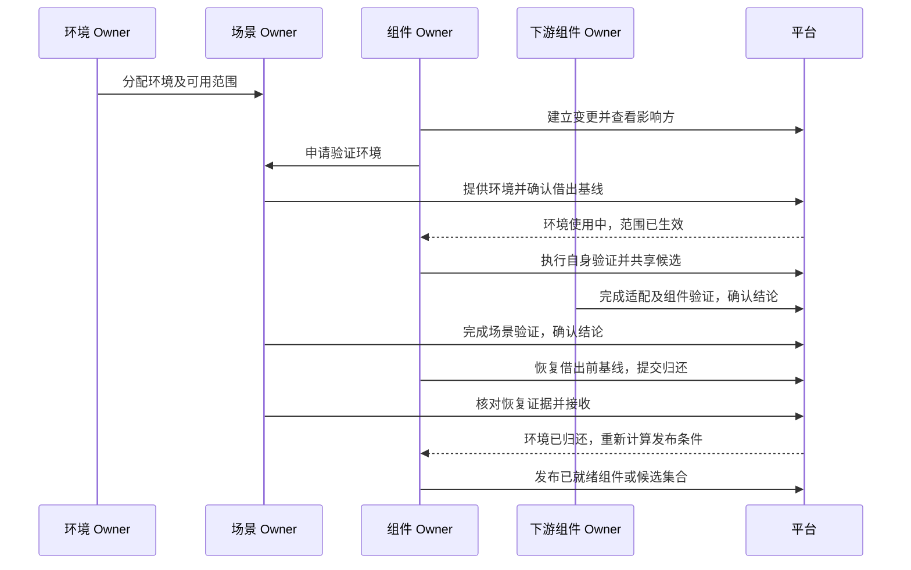
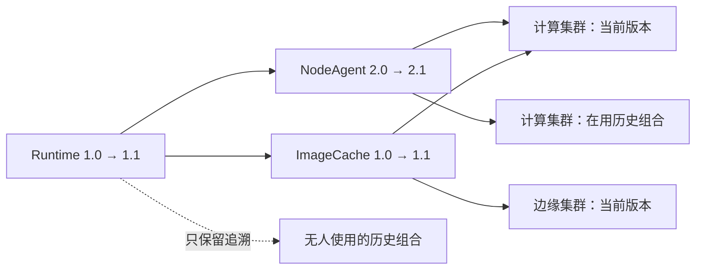
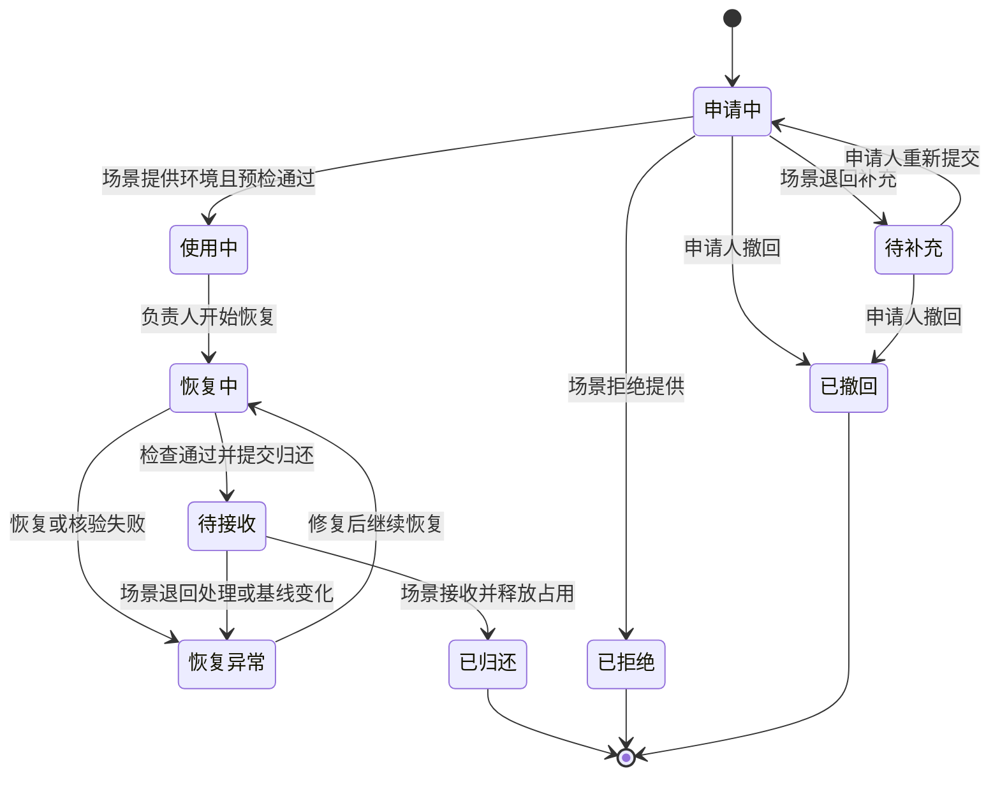
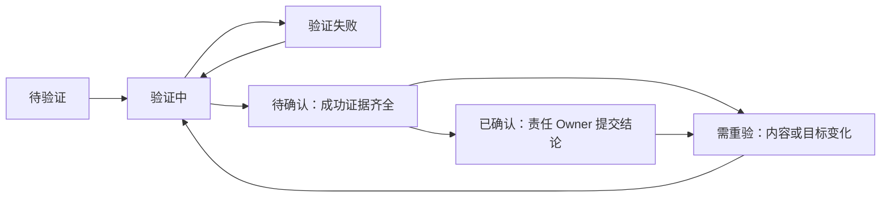

# Owner 协作方案一：组件变更与环境使用流程

> 状态：设计方案，尚未实施。本文描述目标流程，不代表当前平台已经具备这些能力。
> 日期：2026-09-09。代码对照基线：`82434f8`；本次仅编写方案文档。
> 读者：组件 Owner、场景 Owner、环境 Owner、平台 Owner及产品、测试人员。

阅读顺序：**使用流程** → [前端设计](frontend.md) → [后端设计](backend.md)。返回[文档中心](../../README.md)。

## 1. 这次改变什么

组件对自己的交付质量负责，场景组织受影响组合的验证，环境通过明确的使用关系交接。发布的前提是完成验证和归还环境，不再由平台 Owner 审核组件合同，也不再给每次执行单独发起人工审批。

| 事项 | 当前流程 | 目标流程 |
| --- | --- | --- |
| 组件加入候选、发布 | 先通过平台 Owner 合同审核，再满足测试等条件 | 组件完成自身验证后共享候选；自身及影响方验证、归还全部完成后发布 |
| 组件使用环境 | 选择环境发起测试，部分 Run 等环境 Owner 审批 | 向场景申请；场景提供整环境及约定范围，范围内自主执行 |
| 场景正式安装、升级、回滚 | 危险执行由环境 Owner 逐次批准 | 环境 Owner 预先分配权限，场景在范围内自主执行 |
| 环境归还 | 没有独立借还关系 | 恢复借用前基线，场景核对证据并接收后释放占用 |
| 组件变更影响 | 主要用于依赖影响展示和通知 | 生成明确的验证任务，完成情况成为发布条件 |
| 平台 Owner | 目录治理、合同审核、运行历史管理等 | 保留目录治理与历史管理，退出组件合同和执行人工审批 |

三个需要分清的操作：

- **提供环境**：场景交付一段明确范围的使用权，解决在哪里、由谁使用。
- **确认验证结论**：责任 Owner 核对真实证据，确认该版本组合已完成验证。
- **接收归还**：场景确认环境恢复借出前状态，结束使用关系。

后两项都不能脱离证据直接点“通过”，也不用于批准一个尚未执行的 Run。

## 2. 谁负责什么

| 角色 | 主要责任 | 典型入口 | 交给下一方的结果 |
| --- | --- | --- | --- |
| 环境 Owner | 维护主机、环境配置及凭据；分配使用范围；处理收回与故障接管 | 环境 → 使用分配 | 场景可使用、可借出的环境 |
| 场景 Owner | 受理组件借用、安排验证、确认场景结论、接收归还 | 场景 → 环境使用／协作验证 | 环境使用权、场景验证结论、归还回执 |
| 组件 Owner | 编写版本、说明影响、申请环境、完成组件及下游适配、恢复环境 | 组件 → 变更与验证 | 候选版本、组件验证结论、可恢复的归还结果 |
| 平台 Owner | 平台目录、治理配置、审计和历史策略 | 平台管理 | 一致的基础规则和可追溯记录 |

同一申请可由多个组件 Owner 协作，但必须指定一位归还负责人。各人只能修改自己的组件；环境授权不会转移组件、场景或凭据的所有权。

图中省略了多环境的重复借还。同一次变更借用过的环境必须全部接收归还，发布条件才满足。

## 3. 从一次组件变更走完整个流程

以下均为设计示例，不是当前平台实际资产或执行结果。

容器运行时 **Runtime 1.0 → 1.1** 的变更影响两个下游组件 **NodeAgent**、**ImageCache**，进一步影响“计算集群”和“边缘集群”。计算集群另有一个历史版本仍安装在环境中，也需要纳入验证。

实线表示需要验证的引用传播。虚线记录历史关系，不产生发布阻塞。箭头表示依赖影响，不表示自动升级。

### 3.1 环境 Owner 先把环境分配给场景

进入“环境 → 使用分配”，选择接收场景，明确允许动作、凭据引用、介质来源／目标范围及是否允许借给组件。涉及整环境清理的权限单独明确列出，不默认为任意卸载权限的附带能力。

同一环境同时只分配给一个场景。场景可以持有多个环境，其中部分用于自身正式交付，部分允许借用。这里“正式”指平台的场景正式执行模式，当前项目仍以测试环境为运行对象。

既有历史 Run 不自动产生分配关系。尚未分配的环境展示“待分配”，组件不能直接绕过场景使用。

### 3.2 组件 Owner 建立变更并核对影响

在目标 Draft 的“变更与验证”中建立变更，说明修改目的、来源版本、兼容性、验证目标及恢复能力。平台列出：

| 范围 | 用户看到什么 | 谁完成验证 |
| --- | --- | --- |
| 组件自身 | 安装／升级、检查、回滚等交付要求 | 当前组件 Owner |
| 直接或间接下游 | 锁定了哪个旧版本、经过哪些依赖或参数映射 | 对应下游组件 Owner |
| 当前场景 | 受影响的节点组合、参数及业务验收 | 对应场景 Owner |
| 在用历史版本 | 安装来源、历史组合及相关环境 | 对应组件／场景 Owner |
| 纯历史引用 | 历史关系与原因 | 无新增验证任务 |

示例产生五项影响方任务：两个下游组件任务、两个当前场景任务、一个计算集群在用历史组合任务。组件自身验证单独显示，不计入这五项。

组件不能自行删除必须验证的影响方，也不能通过选择“兼容变更”自动跳过他们。图中没有下游的新组件仍需完成自身验证和环境归还，但不会虚构影响方任务。

### 3.3 向场景申请整环境

从变更页面选择“申请环境”，填写用途、接收场景、目标环境、参与组件与人员、允许动作、计划验证任务和预计归还时间。归还目标固定为“恢复借用前基线”。

新组件没有被任何场景引用时，也可以向愿意提供验证环境的场景申请；不要求为借环境先修改场景图。

场景 Owner 在“我的工作”或“场景 → 环境使用”受理：

1. 查看组件变更、影响摘要、测试及恢复范围。
2. 核对环境可借、无活动任务、基础检查及恢复能力。
3. 提供环境，或填写理由退回补充／拒绝提供。
4. 提供成功后，平台记录借出基线，环境进入独占使用。

申请期间不预占环境、不执行测试。多个申请可以等待同一环境；只有成功提供的一份取得使用权，其他申请保留等待，不自动开始。

### 3.4 在约定范围内迭代与验证

使用中页面持续显示接收场景、目标环境、参与者、使用范围、预计归还时间和当前任务。

- 组件 Owner 可在原组件、动作、主机和交付范围内反复修改 Draft、测试、回滚，不需要每次发 Run 再请人批准。
- 每次执行仍需预览目标、步骤及介质选择，并显式提交；同一环境串行执行。
- 增加组件、扩大动作或凭据范围，需要申请调整范围；可以继续做原有效范围内的工作。
- 版本内容变化使对应验证证据和确认结论过期；页面明确显示哪些任务需要重新验证。
- 借用期间场景不对该环境发起无关正式变更；授权参与的场景验证和归还验收可以执行。
- 超期或收到收回请求后停止新测试，保留恢复和交还所需操作。

平台控制其能够识别的目标、版本、动作及凭据范围。组件 Owner 仍须对脚本实际行为和恢复能力负责，不能把表单中的范围说明当作任意脚本副作用已经被自动证明安全。

### 3.5 共享候选，完成影响方验证

Runtime 自身测试达到候选要求后即可共享 Runtime 1.1，供下游验证；此时还不能正式发布。

NodeAgent 和 ImageCache 若需要调整精确依赖或参数映射，由各自 Owner 新建版本，加入同一个协同候选集合并完成自身验证。已发布的旧合同保持不变。

场景 Owner 使用专用验证副本测试新组合，不修改正式版本。对在用历史组合，锁定对应来源版本及适配条件，在适合的验证环境中完成验证，不要求直接修改正在使用的历史环境。

每个任务都要先有匹配版本内容的成功执行证据，再由对应责任 Owner 提交验证结论。借出环境不代表同意验证结论；发起人也不能替其他 Owner 确认。

### 3.6 恢复并提交归还

归还负责人从“使用中”进入“恢复与归还”，查看借出时的版本、配置、安装来源和恢复方案，预览并执行恢复。

| 借出前情况 | 归还要求 |
| --- | --- |
| 干净环境 | 移除本次安装，完成清理后检查，恢复原有基础配置 |
| 已有组件或场景 | 恢复借出前版本、参数、配置及约定备份数据，完成组件检查和原场景业务验收 |
| 无法确认基线或缺少恢复能力 | 不得借出；不能先借用，再假定一定能够恢复 |

归还不等同于删除全部目录、清空数据库或卸载所有组件。恢复目标始终是这次借出的基线。

恢复期间如果发生失败，环境继续占用，页面给出失败证据与恢复入口。失败的测试结果仍保留；恢复成功不会把测试失败改成通过。

### 3.7 场景 Owner 接收归还

提交归还后，环境进入“待接收”，停止新的测试及内容变更执行。场景 Owner 查看借出基线、恢复前后对照、执行证据和剩余问题。

只有无活动任务、基线及恢复检查匹配、原场景验收通过时，才能“接收归还”。收到过期页面、出现新的修改或检查结果变化时，必须重新核对。

接收成功后释放占用。退回处理时仍保留占用和原申请，归还负责人继续恢复。

### 3.8 发布

变更页面展示四组发布条件：

1. 所有候选成员的合同及自身验证就绪。
2. 全部必须完成的影响方验证均有有效证据和责任 Owner 确认。
3. 本次变更的全部借用均已接收归还；没有未关闭申请或范围调整。
4. 发布前重新核对影响范围、依赖闭包及版本内容，未出现新的阻塞。

满足后，组件 Owner 发布自己的版本；协同集合由各成员 Owner 授权联合发布，再一次性提交。保留场景联合发布入口，但它也必须满足整个集合的上述条件，不能因一个场景验证成功而绕过另一个场景。

组件发布后，原场景和原环境继续使用锁定的旧版本。要实际采用新版本，由场景另行创建目标版本并在分配范围内执行正式安装或升级。

## 4. 状态怎样变化

### 4.1 借用状态

“超期”“请求收回”“待调整范围”是提示或限制，不代替借用状态。只有“已归还”会结束已发生的占用，不能因超期、退出页面或取消 Run 自动释放。

### 4.2 验证任务状态

任务已确认与环境已归还是两件事。前者证明新版本组合通过验证，后者证明借用环境恢复原状；两者都必须完成才能发布。

## 5. 常见异常怎么处理

| 情况 | 谁处理 | 下一步 | 是否保持占用／阻塞发布 |
| --- | --- | --- | --- |
| 场景暂无可借环境 | 场景 Owner | 提供其他已分配环境，或退回说明 | 未取得占用；验证仍未完成 |
| 下游暂时不采用新版本 | 下游／场景 Owner | 仍需完成新组合的适配验证，正式采用可以以后安排 | 未验证则阻塞；没有无证据豁免 |
| 验证失败 | 对应责任 Owner | 修复自己的候选版本后重验 | 借用未结束则保持占用 |
| 新版本内容又修改 | 相关责任 Owner | 查看过期任务，重新验证并确认 | 已归还环境不重新占用；需要执行时新申请 |
| 使用范围不足 | 申请人、场景 Owner | 调整申请范围，必要时先调整环境分配 | 原范围仍有效，扩大部分不可执行 |
| 恢复失败或缺少备份 | 归还负责人，必要时环境 Owner | 保留现场，修复恢复能力或故障接管 | 保持占用并阻塞发布 |
| 到期或收回 | 归还负责人、场景 Owner | 停止新测试，完成恢复交还 | 不自动释放 |
| 页面数据已过期 | 当前操作者 | 刷新具体变更及证据，再操作 | 不覆盖其他人已提交的结果 |
| 一个 Owner 退出协同集合 | 集合负责人和各责任 Owner | 重建有效候选集合及影响任务 | 不撤销已发生借用的归还责任 |

## 6. 如何验收这个流程

- 组件及场景在有效范围内完成测试、回滚或正式执行，不出现逐 Run 审批等待。
- 平台 Owner 不再收到组件合同审核任务，发布仍受完整质量条件约束。
- 五个示例影响方任务可以分别追踪负责人、版本、执行证据和结论；一个失败或过期任务都阻止发布。
- 提供、使用、恢复、接收均有明确责任人；恢复失败和超期不释放环境。
- 所有环境恢复并接收后，发布按钮才因归还条件满足而解锁；发布本身不执行环境升级。
- 首次发布、在用历史组合、多个组件协同、多个环境顺序借用均能完成闭环。

页面组织、线框及按钮条件见[前端设计](frontend.md)；状态约束、接口及证据规则见[后端设计](backend.md)。
